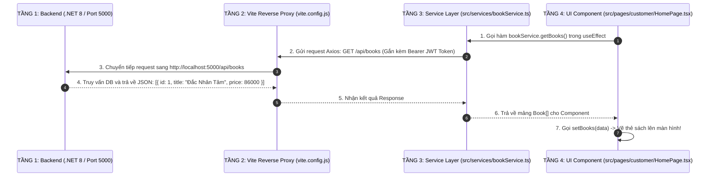

# HƯỚNG DẪN TOÀN TẬP VỀ KẾT NỐI API VÀ LẤY DỮ LIỆU TỪ BACKEND CHO FRONTEND

> **Tài liệu hướng dẫn trực quan dành riêng cho dự án BookVerse**  
> **Mục tiêu:** Giúp bạn hiểu từ gốc rễ bản chất API, cách Backend trả dữ liệu, nơi cấu hình và cách gắn API vào mã nguồn React.

---

## 📑 MỤC LỤC BÀI HỌC

1. [Bản chất API là gì? Có phải Backend trả dữ liệu bằng nhiều API khác nhau?](#1-bản-chất-api-là-gì-có-phải-backend-trả-dữ-liệu-bằng-nhiều-api-khác-nhau)
2. [Bức tranh 4 tầng: Luồng đi của dữ liệu từ Database Backend lên màn hình React](#2-bức-tranh-4-tầng-luồng-đi-của-dữ-liệu-từ-database-backend-lên-màn-hình-react)
3. [Chỗ nào trong source code cấu hình và gắn các API đó? (Bản đồ tệp tin)](#3-chỗ-nào-trong-source-code-cấu-hình-và-gắn-các-api-đó-bản-đồ-tệp-tin)
4. [Hướng dẫn thực hành chi tiết 4 loại thao tác API kinh điển (CRUD)](#4-hướng-dẫn-thực-hành-chi-tiết-4-loại-thao-tác-api-kinh-điển-crud)
5. [Cơ chế "Graceful Fallback Mock" của BookVerse hoạt động ra sao?](#5-cơ-chế-graceful-fallback-mock-của-bookverse-hoạt-động-ra-sao)
6. [Bảng tra cứu toàn bộ 44 Endpoints API của BookVerse](#6-bảng-tra-cứu-toàn-bộ-44-endpoints-api-của-bookverse)

---

## 1. BẢN CHẤT API LÀ GÌ? CÓ PHẢI BACKEND TRẢ DỮ LIỆU BẰNG NHIỀU API KHÁC NHAU?

### 1.1. Câu trả lời ngắn gọn: **ĐÚNG VẬY!**
Backend không trả về tất cả dữ liệu trong một cục duy nhất, mà chia nhỏ thành **nhiều API riêng biệt (gọi là các Endpoints / Cổng giao tiếp)** tương ứng với từng thực thể và hành động nghiệp vụ.

```
┌────────────────────────────────────────────────────────────────────────┐
│                   BACKEND WEB API (.NET 8 / Java / Node)               │
└───────┬─────────────────┬──────────────────┬───────────────────┬───────┘
        │ GET /api/books  │ GET /api/orders  │ POST /api/orders  │ PATCH /api/users/1
        ▼                 ▼                  ▼                   ▼
┌──────────────┐  ┌──────────────┐   ┌───────────────┐   ┌───────────────┐
│ Lấy DS Sách  │  │ Lấy DS Đơn   │   │  Tạo Đơn Hàng │   │ Khóa/Mở User  │
└──────────────┘  └──────────────┘   └───────────────┘   └───────────────┘
```

---

### 1.2. Các phương thức HTTP (HTTP Methods) chuẩn RESTful:
Mỗi hành động nghiệp vụ được Backend quy định bằng một **Phương thức HTTP (HTTP Method)**:

| Phương thức | Ý nghĩa hành động | Ví dụ trong BookVerse |
| :--- | :--- | :--- |
| **`GET`** | **Lấy dữ liệu** từ server về máy (không làm thay đổi database). | `GET /api/books` (Lấy danh sách sách)<br>`GET /api/books/5` (Lấy chi tiết sách ID = 5) |
| **`POST`** | **Tạo mới** một bản ghi dữ liệu lên server. | `POST /api/auth/login` (Đăng nhập)<br>`POST /api/orders` (Đặt mua đơn hàng mới) |
| **`PUT` / `PATCH`** | **Cập nhật / Chỉnh sửa** dữ liệu đã có. | `PUT /api/books/5` (Sửa thông tin sách)<br>`PATCH /api/orders/10/status` (Đổi trạng thái đơn sang Đang giao) |
| **`DELETE`** | **Xóa / Ẩn** một bản ghi khỏi hệ thống. | `DELETE /api/books/5` (Xóa sách khỏi gian hàng) |

---

## 2. BỨC TRANH 4 TẦNG: LUỒNG ĐI CỦA DỮ LIỆU TỪ DATABASE LÊN MÀN HÌNH

Dữ liệu di chuyển tuần tự qua 4 tầng kiến trúc rõ ràng:



---

## 3. CHỖ NÀO TRONG SOURCE CODE CẤU HÌNH VÀ GẮN CÁC API ĐÓ? (BẢN ĐỒ TỆP TIN)

Trong dự án BookVerse, việc kết nối API được chia thành **4 vị trí chính xác** trong mã nguồn:

```text
Frontend/
├── .env.development            📍 NƠI 1: Khai báo địa chỉ gốc của API (VITE_API_URL=/api)
├── vite.config.js              📍 NƠI 2: Cấu hình Reverse Proxy chuyển tiếp /api -> localhost:5000
└── src/
    ├── services/
    │   ├── api.ts              📍 NƠI 3: Cấu hình Axios Base Client, Header & Tự động gắn Token
    │   ├── authService.ts      📍 NƠI 4: Gắn các API liên quan đến Đăng nhập, Hồ sơ
    │   ├── bookService.ts      📍 NƠI 4: Gắn các API Sách, Tìm kiếm, Danh mục
    │   ├── orderService.ts     📍 NƠI 4: Gắn các API Đơn hàng, Hủy đơn, Đánh giá
    │   ├── shopService.ts      📍 NƠI 4: Gắn các API Kho sách của Shop, Doanh thu
    │   ├── adminService.ts     📍 NƠI 4: Gắn các API Duyệt Shop, Khóa User, Phân xử
    │   └── chatService.ts      📍 NƠI 4: Gắn các API Nhắn tin trò chuyện
    └── pages/
        └── customer/
            └── HomePage.tsx    📍 NƠI 5: Gọi hàm từ Service để lấy dữ liệu đổ ra JSX
```

---

### Chi tiết từng vị trí cấu hình:

#### 📍 Vị trí 1: Khai báo Biến môi trường ([`.env.development`](file:///Users/nguyenvanminhtam/Frontend/.env.development))
```env
# Định nghĩa tiền tố API
VITE_API_URL=/api
```

---

#### 📍 Vị trí 2: Cấu hình Reverse Proxy ([`vite.config.js`](file:///Users/nguyenvanminhtam/Frontend/vite.config.js))
*Nhiệm vụ: Khi trình duyệt gửi request tới `/api/*`, Vite sẽ tự động chuyển tiếp ngầm sang Backend `http://localhost:5000`, giúp tránh hoàn toàn lỗi chặn CORS.*

```javascript
export default defineConfig({
  plugins: [react()],
  server: {
    port: 5173,
    proxy: {
      '/api': {
        target: 'http://localhost:5000', // Cổng Backend .NET 8 của bạn
        changeOrigin: true,
        secure: false,
      },
    },
  },
});
```

---

#### 📍 Vị trí 3: Axios Client & Tự động gắn Bearer Token ([`src/services/api.ts`](file:///Users/nguyenvanminhtam/Frontend/src/services/api.ts))
*Nhiệm vụ: Tạo một cỗ máy gửi request duy nhất cho cả dự án, tự động lấy token người dùng trong LocalStorage gắn vào Header.*

```typescript
export const apiClient = axios.create({
  baseURL: import.meta.env.VITE_API_URL || "/api",
  headers: { "Content-Type": "application/json" },
  timeout: 15000,
});

// Tự động gắn Token vào mọi request gửi lên Backend
apiClient.interceptors.request.use((config) => {
  const token = localStorage.getItem("auth_token");
  if (token && config.headers) {
    config.headers.Authorization = `Bearer ${token}`;
  }
  return config;
});
```

---

#### 📍 Vị trí 4: Tầng Service khai báo từng API Endpoint ([`src/services/bookService.ts`](file:///Users/nguyenvanminhtam/Frontend/src/services/bookService.ts))
*Nhiệm vụ: Nơi viết các hàm JavaScript gọi tới từng đường dẫn API cụ thể.*

```typescript
import { apiClient } from "./api";
import { Book } from "../types";

export const bookService = {
  // API Lấy danh sách sách: GET /api/books?search=...
  async getBooks(search?: string): Promise<Book[]> {
    const res = await apiClient.get<Book[]>("/books", {
      params: { search },
    });
    return res.data; // Trả về mảng sách lấy được từ backend
  },

  // API Lấy chi tiết 1 cuốn sách: GET /api/books/123
  async getBookById(id: number): Promise<Book> {
    const res = await apiClient.get<Book>(`/books/${id}`);
    return res.data;
  },

  // API Tạo sách mới: POST /api/books
  async createBook(bookData: Partial<Book>): Promise<Book> {
    const res = await apiClient.post<Book>("/books", bookData);
    return res.data;
  },
};
```

---

#### 📍 Vị trí 5: Component gọi Service và hiển thị lên giao diện ([`src/pages/customer/HomePage.tsx`](file:///Users/nguyenvanminhtam/Frontend/src/pages/customer/HomePage.tsx))

```tsx
export const HomePage: React.FC = () => {
  // 1. Tạo State để chứa dữ liệu sách lấy về
  const [books, setBooks] = useState<Book[]>([]);
  const [loading, setLoading] = useState<boolean>(true);

  // 2. Dùng useEffect để tự động gọi API ngay khi mở trang
  useEffect(() => {
    bookService.getBooks()
      .then((data) => {
        setBooks(data); // Lưu dữ liệu vào state
      })
      .catch((err) => {
        console.error("Lỗi gọi API:", err);
      })
      .finally(() => {
        setLoading(false); // Tắt màn hình chờ
      });
  }, []); // [] = chỉ gọi 1 lần khi mở trang

  // 3. Render dữ liệu ra HTML/JSX
  if (loading) return <p>Đang tải sách...</p>;

  return (
    <div className="grid grid-cols-4 gap-4">
      {books.map((book) => (
        <div key={book.id} className="border p-4 rounded-xl">
          <h3>{book.title}</h3>
          <p className="text-blue-600 font-bold">{book.price} đ</p>
        </div>
      ))}
    </div>
  );
};
```

---

## 4. HƯỚNG DẪN THỰC HÀNH CHI TIẾT 4 LOẠI THAO TÁC API (CRUD)

### 🟢 1. Thao tác GET (Lấy dữ liệu)
```typescript
// Trong orderService.ts:
async getOrders(customerId: number): Promise<Order[]> {
  // Gửi request: GET /api/orders?customerId=1
  const res = await apiClient.get<Order[]>(`/orders?customerId=${customerId}`);
  return res.data;
}
```

### 🔵 2. Thao tác POST (Tạo mới dữ liệu)
```typescript
// Trong orderService.ts:
async createOrder(payload: CreateOrderRequest): Promise<Order> {
  // Gửi request: POST /api/orders kèm body JSON
  const res = await apiClient.post<Order>("/orders", payload);
  return res.data;
}
```

### 🟡 3. Thao tác PATCH / PUT (Chỉnh sửa trạng thái)
```typescript
// Trong shopService.ts:
async updateOrderStatus(orderId: number, status: string): Promise<boolean> {
  // Gửi request: PATCH /api/orders/1001/status kèm body { status: "SHIPPED" }
  await apiClient.patch(`/orders/${orderId}/status`, { status });
  return true;
}
```

### 🔴 4. Thao tác DELETE (Xóa dữ liệu)
```typescript
// Trong bookService.ts:
async deleteBook(bookId: number): Promise<boolean> {
  // Gửi request: DELETE /api/books/5
  await apiClient.delete(`/books/${bookId}`);
  return true;
}
```

---

## 5. CƠ CHẾ "GRACEFUL FALLBACK MOCK" CỦA BOOKVERSE HOẠT ĐỘNG RA SAO?

Trong dự án BookVerse, tất cả các hàm trong tầng Service đều được bọc trong khối `try { ... } catch { ... }`:

```typescript
async getBooks(): Promise<Book[]> {
  try {
    // 1. Thử gọi API thật tới Backend .NET 8
    const res = await apiClient.get<Book[]>("/books");
    return res.data;
  } catch (error) {
    // 2. Nếu Backend CHƯA BẬT hoặc MẤT MẠNG -> Tự động trả về Mock Data!
    console.warn("[Backend Offline] Đang trả về dữ liệu mẫu trong mockData.ts");
    return INITIAL_BOOKS;
  }
}
```

> 🎯 **Lợi ích tuyệt vời:**
> - Khi bạn **chưa bật Backend**: Frontend vẫn chạy mượt mà 100%, không bị báo lỗi đỏ hay sập màn hình.
> - Khi bạn **bật Backend lên**: Frontend sẽ tự động lấy dữ liệu thật từ SQL Server / Database của Backend mà bạn **không cần sửa lại 1 dòng code nào trong các trang UI**!

---

## 6. BẢNG TRA CỨU TOÀN BỘ 44 ENDPOINTS API CỦA BOOKVERSE

| Nhóm Nghiệp Vụ | Hành động | HTTP Method | URL Endpoint | Tệp Service phụ trách |
| :--- | :--- | :---: | :--- | :--- |
| **Xác thực (Auth)** | Đăng nhập | `POST` | `/api/auth/login` | [`authService.ts`](file:///Users/nguyenvanminhtam/Frontend/src/services/authService.ts) |
| | Đăng ký tài khoản | `POST` | `/api/auth/register` | [`authService.ts`](file:///Users/nguyenvanminhtam/Frontend/src/services/authService.ts) |
| | Cập nhật hồ sơ | `PUT` | `/api/auth/profile` | [`authService.ts`](file:///Users/nguyenvanminhtam/Frontend/src/services/authService.ts) |
| | Đăng ký mở gian hàng | `POST` | `/api/shops/register` | [`authService.ts`](file:///Users/nguyenvanminhtam/Frontend/src/services/authService.ts) |
| **Sách & Danh mục** | Lấy danh sách sách & tìm kiếm | `GET` | `/api/books` | [`bookService.ts`](file:///Users/nguyenvanminhtam/Frontend/src/services/bookService.ts) |
| | Xem chi tiết 1 cuốn sách | `GET` | `/api/books/{id}` | [`bookService.ts`](file:///Users/nguyenvanminhtam/Frontend/src/services/bookService.ts) |
| | Thêm sách mới (Shop) | `POST` | `/api/books` | [`shopService.ts`](file:///Users/nguyenvanminhtam/Frontend/src/services/shopService.ts) |
| | Sửa thông tin sách | `PUT` | `/api/books/{id}` | [`shopService.ts`](file:///Users/nguyenvanminhtam/Frontend/src/services/shopService.ts) |
| | Xóa/Ẩn sách | `DELETE` | `/api/books/{id}` | [`shopService.ts`](file:///Users/nguyenvanminhtam/Frontend/src/services/shopService.ts) |
| | Xem sách theo từng Shop | `GET` | `/api/shops/{shopId}/books` | [`bookService.ts`](file:///Users/nguyenvanminhtam/Frontend/src/services/bookService.ts) |
| **Đơn hàng (Orders)** | Đặt mua sách (Checkout) | `POST` | `/api/orders` | [`orderService.ts`](file:///Users/nguyenvanminhtam/Frontend/src/services/orderService.ts) |
| | Lấy lịch sử đơn hàng của tôi | `GET` | `/api/orders?customerId={id}` | [`orderService.ts`](file:///Users/nguyenvanminhtam/Frontend/src/services/orderService.ts) |
| | Xem chi tiết đơn hàng | `GET` | `/api/orders/{id}` | [`orderService.ts`](file:///Users/nguyenvanminhtam/Frontend/src/services/orderService.ts) |
| | Hủy đơn hàng | `POST` | `/api/orders/{id}/cancel` | [`orderService.ts`](file:///Users/nguyenvanminhtam/Frontend/src/services/orderService.ts) |
| | Đổi trạng thái đơn (Shop/Shipper) | `PATCH` | `/api/orders/{id}/status` | [`shopService.ts`](file:///Users/nguyenvanminhtam/Frontend/src/services/shopService.ts) |
| | Gửi đánh giá sản phẩm | `POST` | `/api/orders/{id}/feedback` | [`orderService.ts`](file:///Users/nguyenvanminhtam/Frontend/src/services/orderService.ts) |
| | Shop trả lời đánh giá | `POST` | `/api/orders/{id}/feedback/reply` | [`shopService.ts`](file:///Users/nguyenvanminhtam/Frontend/src/services/shopService.ts) |
| | Yêu cầu đổi trả & hoàn tiền | `POST` | `/api/orders/{id}/return` | [`orderService.ts`](file:///Users/nguyenvanminhtam/Frontend/src/services/orderService.ts) |
| **Quản trị (Admin)** | Lấy danh sách tài khoản | `GET` | `/api/admin/users` | [`adminService.ts`](file:///Users/nguyenvanminhtam/Frontend/src/services/adminService.ts) |
| | Khóa / Mở khóa tài khoản | `PATCH` | `/api/admin/users/{id}/toggle-status` | [`adminService.ts`](file:///Users/nguyenvanminhtam/Frontend/src/services/adminService.ts) |
| | Duyệt hồ sơ mở Shop | `PATCH` | `/api/admin/shops/{id}/approve` | [`adminService.ts`](file:///Users/nguyenvanminhtam/Frontend/src/services/adminService.ts) |
| | Phân xử khiếu nại & Hoàn tiền | `PATCH` | `/api/admin/returns/{id}` | [`adminService.ts`](file:///Users/nguyenvanminhtam/Frontend/src/services/adminService.ts) |
| **Tin nhắn & Thông báo**| Lấy tin nhắn giữa Khách & Shop| `GET` | `/api/chat/messages` | [`chatService.ts`](file:///Users/nguyenvanminhtam/Frontend/src/services/chatService.ts) |
| | Gửi tin nhắn mới | `POST` | `/api/chat/messages` | [`chatService.ts`](file:///Users/nguyenvanminhtam/Frontend/src/services/chatService.ts) |
| | Lấy danh sách thông báo | `GET` | `/api/notifications` | [`notificationService.ts`](file:///Users/nguyenvanminhtam/Frontend/src/services/notificationService.ts) |
| | Đánh dấu đã đọc thông báo | `PATCH` | `/api/notifications/{id}/read` | [`notificationService.ts`](file:///Users/nguyenvanminhtam/Frontend/src/services/notificationService.ts) |
