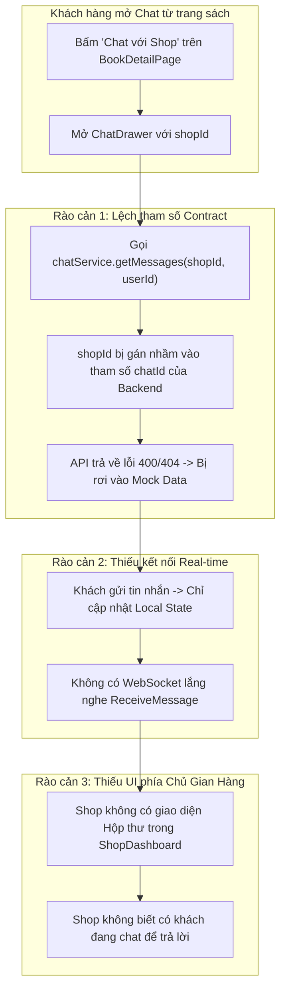
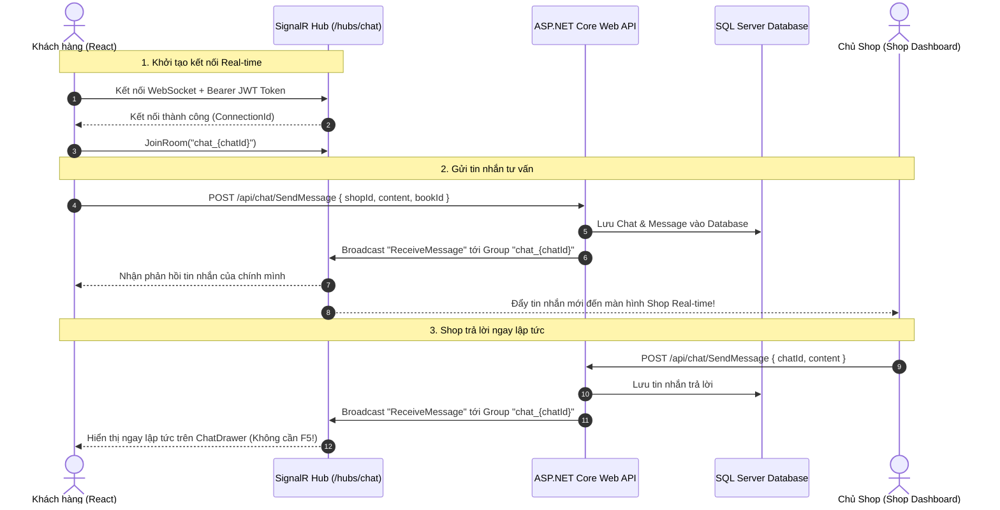

# BÁO CÁO PHÂN TÍCH & GIẢI PHÁP TOÀN DIỆN: TÍNH NĂNG CHAT TƯ VẤN SÁCH REAL-TIME (CUSTOMER - SHOP)

> **Dự án:** Sàn thương mại điện tử sách BookVerse  
> **Phạm vi tài liệu:** Phân tích kiến trúc, luồng nghiệp vụ, mức độ hỗ trợ Real-time, các rào cản/bất cập hiện tại và giải pháp thiết kế tối ưu cho phân hệ Chat giữa Khách hàng (Customer) và Gian hàng (Shop).  
> **Nguyên tắc:** Báo cáo tài liệu kỹ thuật chuyên sâu (Documentation Only - Không chỉnh sửa code).

---

## I. TỔNG QUAN HIỆN TRẠNG PHÂN HỆ CHAT (CURRENT ARCHITECTURE)

### 1. Luồng kích hoạt Chat từ phía Khách hàng (Customer Flow)
Hiện tại trên giao diện người dùng, tính năng Chat được tích hợp tại 3 vị trí:
1. **Trang chi tiết sách ([BookDetailPage.tsx](file:///Users/nguyenvanminhtam/Frontend/src/pages/customer/BookDetailPage.tsx#L146)):**
   - Dưới thông tin sách, cạnh mục *"Cung cấp bởi: {book.shopName}"* có nút bấm `Chat với Shop`.
   - Khi bấm, state `chatOpen = true` sẽ kích hoạt hiển thị Component [ChatDrawer.tsx](file:///Users/nguyenvanminhtam/Frontend/src/components/chat/ChatDrawer.tsx) trượt ra từ cạnh phải màn hình với `shopId={book.shopId}` và `shopName={book.shopName}`.
2. **Trang hồ sơ gian hàng ([ShopProfilePage.tsx](file:///Users/nguyenvanminhtam/Frontend/src/pages/customer/ShopProfilePage.tsx#L103)):**
   - Trên banner của gian hàng có nút `Nhắn tin tư vấn` mở `ChatDrawer` với `shopId` của shop đó.
3. **Thanh điều hướng toàn cục ([Header.tsx](file:///Users/nguyenvanminhtam/Frontend/src/components/common/Header.tsx#L97)):**
   - Có icon tin nhắn trên Header mở `ChatDrawer` với cấu hình mặc định (`shopId = 1`).

---

### 2. Kiến trúc Cổng API & Backend (.NET 8 Web API)
Backend đã xây dựng sẵn sàng các thành phần cốt lõi trong [ChatController.cs](file:///Users/nguyenvanminhtam/Frontend/Backend/BookManagement.Api/Controllers/ChatController.cs) và [ChatService.cs](file:///Users/nguyenvanminhtam/Frontend/Backend/BookManagement.Service/Chat/ChatService.cs):

| Cổng API Endpoint | Phương thức | Mục đích nghiệp vụ | Quyền truy cập |
| :--- | :---: | :--- | :---: |
| `/api/chat/GetUserConversations` | `GET` | Lấy danh sách các cuộc trò chuyện của khách hàng với các shop | `[Authorize]` |
| `/api/chat/GetShopConversations` | `GET` | Lấy danh sách các khách hàng đang nhắn tin tới Shop của user | `[Authorize]` |
| `/api/chat/GetConversationMessages?chatId={id}` | `GET` | Xem toàn bộ lịch sử tin nhắn trong phòng chat & tự động đánh dấu đã đọc (`IsRead = true`) | `[Authorize]` |
| `/api/chat/SendMessage` | `POST` | Gửi tin nhắn mới (hỗ trợ text & hình ảnh), tự động tạo bản ghi `Chats` nếu chưa có | `[Authorize]` |

---

## II. ĐÁNH GIÁ MỨC ĐỘ ÁP DỤNG REAL-TIME (SIGNALR)

### 1. Phía Máy chủ (Backend): 🟢 ĐÃ HỖ TRỢ NỀN TẢNG SIGNALR
- Backend đã định nghĩa `ChatHub` ([ChatHub.cs](file:///Users/nguyenvanminhtam/Frontend/Backend/BookManagement.Api/Hubs/ChatHub.cs)) kế thừa từ `Microsoft.AspNetCore.SignalR.Hub`.
- Đã đăng ký Hub endpoint tại `Program.cs`: `app.MapHub<ChatHub>("/hubs/chat")`.
- Khi người dùng gửi tin nhắn qua `POST /api/chat/SendMessage`, Backend thực hiện phát tín hiệu (broadcast) tới phòng chat tương ứng:
  ```csharp
  string roomName = $"chat_{messageDto.ChatId}";
  await _hubContext.Clients.Group(roomName).SendAsync("ReceiveMessage", messageDto);
  ```
- Hub hỗ trợ các hàm: `JoinRoom(roomName)`, `LeaveRoom(roomName)`, `SendMessageToShop`, `SendMessageToUser`.

### 2. Phía Trình duyệt (Frontend): 🔴 CHƯA ÁP DỤNG ĐƯỢC REAL-TIME
Mặc dù Backend đã có SignalR Hub, **phía Frontend hiện tại HOÀN TOÀN CHƯA KẾT NỐI REAL-TIME**. Cụ thể:
1. **Chưa cài đặt SDK SignalR Client:** Trong file [package.json](file:///Users/nguyenvanminhtam/Frontend/package.json), dự án chưa có thư viện `@microsoft/signalr`.
2. **Không có WebSocket Connection:** Frontend chưa khởi tạo `HubConnectionBuilder`, không duy trì kết nối WebSocket tới URL `ws://localhost:5226/hubs/chat` (dù biến môi trường `VITE_WS_CHAT_URL` đã được khai báo sẵn).
3. **Không lắng nghe sự kiện phát tin nhắn:** Frontend không có trình lắng nghe (listener) sự kiện `ReceiveMessage` từ server.
4. **Cơ chế hiển thị hiện tại là Local State Optimistic Update:**
   - Khi khách hàng bấm gửi, tin nhắn chỉ được đẩy vào mảng `messages` nội bộ trong React state (`setMessages((prev) => [...prev, newMsg])`).
   - Nếu Shop phản hồi lại tin nhắn, giao diện của khách hàng **không hề tự động cập nhật**. Khách hàng buộc phải tắt Drawer và mở lại (để hàm `useEffect` gọi lại REST API lấy lịch sử).

---

## III. CÁC KHÓ KHĂN, BẤT CẬP & LỖ HỔNG HIỆN TẠI (CURRENT BOTTLENECKS)



### 1. Rào cản 1: Lệch tham số giữa UI và Service (`ChatDrawer.tsx` vs `chatService.ts`)
- Trong [ChatDrawer.tsx](file:///Users/nguyenvanminhtam/Frontend/src/components/chat/ChatDrawer.tsx#L27):
  ```typescript
  chatService.getMessages(shopId, user?.id || 1).then(setMessages);
  ```
- Nhưng trong [chatService.ts](file:///Users/nguyenvanminhtam/Frontend/src/services/chatService.ts#L31):
  ```typescript
  async getMessages(chatId?: string | number, shopId?: string | number, customerId?: string | number)
  ```
- **Hệ quả:** Tham số `shopId` bị truyền vào vị trí của `chatId`. Khi gọi Backend `GET /api/chat/GetConversationMessages?chatId={shopId}`, Backend không thể tìm thấy hội thoại (vì `shopId` là mã cửa hàng, không phải mã cuộc trò chuyện `chatId` dạng Guid). Khi đó API sẽ lỗi và Frontend rơi vào dữ liệu mẫu `INITIAL_MESSAGES`.

### 2. Rào cản 2: Chưa có giao diện Chat cho Chủ Gian hàng (Shop Dashboard)
- Backend có sẵn `GET /api/chat/GetShopConversations` để Shop lấy danh sách các cuộc trò chuyện của khách hàng.
- Tuy nhiên trên giao diện [ShopDashboardPage.tsx](file:///Users/nguyenvanminhtam/Frontend/src/pages/shop/ShopDashboardPage.tsx), **hoàn toàn chưa có Tab "Tin nhắn / Tư vấn khách hàng"**.
- Chủ gian hàng khi đăng nhập không có màn hình để:
  - Xem danh sách khách đang hỏi về sách.
  - Xem tin nhắn mới nhất và số lượng tin nhắn chưa đọc.
  - Gõ tin nhắn trả lời trực tiếp cho khách.

### 3. Rào cản 3: Thiếu thông tin cuốn sách cụ thể khi bắt đầu Chat (Book Context)
- Khi khách hàng bấm "Chat với Shop" từ một cuốn sách cụ thể (ví dụ: *"Nhà Giả Kim - Giá 79.000đ"*), khung chat mở ra chỉ có khung nhập chữ trống rỗng.
- Khung chat **không đính kèm thẻ xem trước sản phẩm (Product Preview Card)** và không có nút gửi nhanh (Quick Action: *"Tôi muốn hỏi về cuốn sách này"*).
- Chủ shop khi nhận tin nhắn chỉ thấy nội dung chữ mà không biết khách đang hỏi về đầu sách nào trong danh mục hàng trăm cuốn sách của shop.

### 4. Rào cản 4: Xác thực JWT khi bắt tay kết nối WebSocket (SignalR Handshake)
- `ChatHub` trên Backend được bảo vệ bởi `[Authorize]`.
- Khi kết nối SignalR qua WebSocket, trình duyệt không tự động gắn header `Authorization: Bearer <Token>`.
- Cần cấu hình `accessTokenFactory` trong SignalR Client để truyền Token qua query string `?access_token=...` theo đúng chuẩn của ASP.NET Core SignalR.

---

## IV. GIẢI PHÁP KỸ THUẬT & LỘ TRÌNH TRIỂN KHAI TOÀN DIỆN

### 1. Kiến trúc Tích hợp SignalR Real-time Client



### 2. Thiết kế Chi tiết từng Thành phần (Detailed Blueprint)

#### A. Cài đặt Thư viện SignalR Client
Bổ sung thư viện chính thức của Microsoft:
```bash
npm install @microsoft/signalr
```

#### B. Xây dựng Module Quản lý Kết nối SignalR (`src/services/signalRService.ts`)
Tạo một singleton service để quản lý vòng đời kết nối:
- Tự động lấy JWT Token từ `localStorage`.
- Hỗ trợ cơ chế tự động kết nối lại khi mất mạng (`withAutomaticReconnect()`).
- Cung cấp các phương thức tiện ích: `startConnection()`, `joinChatRoom(chatId)`, `leaveChatRoom(chatId)`, `onReceiveMessage(callback)`.

#### C. Hoàn thiện Chuẩn hóa API Contract trong `chatService.ts`
1. Sửa hàm `getMessages`:
   - Nếu đã có `chatId` -> Gọi `GET /api/chat/GetConversationMessages?chatId={chatId}`.
   - Nếu chỉ có `shopId` -> Trước tiên gọi `GET /api/chat/GetUserConversations` để tìm `chatId` tương ứng giữa User và Shop đó. Nếu chưa có cuộc trò chuyện nào, trả về danh sách rỗng (cuộc trò chuyện mới).
2. Khi gửi tin nhắn đầu tiên:
   - Truyền `shopId` lên `POST /api/chat/SendMessage`. Backend sẽ tự tạo bản ghi `Chat` và trả về `chatId` mới.
   - Sau đó Client tự động gọi `joinChatRoom(chatId)` để bắt đầu lắng nghe real-time.

#### D. Bổ sung Thẻ Sản phẩm (Book Card Header) vào `ChatDrawer.tsx`
- Bổ sung `book?: Book` vào `ChatDrawerProps`.
- Khi khách mở chat từ `BookDetailPage`, hiển thị một thẻ nhỏ ghim ở đầu hộp chat gồm: Ảnh bìa sách, Tên sách, Giá niêm yết và nút bấm nhanh: *"Hỏi xem cuốn sách này còn hàng không"*.

#### E. Xây dựng Tab Quản lý Tin nhắn trong `ShopDashboardPage.tsx`
Bổ sung Tab **"Hộp thư tư vấn"** trên giao diện Shop Dashboard:
- **Cột trái:** Danh sách khách hàng đã nhắn tin, hiển thị avatar khách, tin nhắn mới nhất, thời gian và số tin chưa đọc (Unread Badge).
- **Cột phải:** Cửa sổ trò chuyện trực tiếp với khách hàng đã chọn, tích hợp SignalR lắng nghe tin nhắn mới từ khách hàng theo thời gian thực.

---

## V. KẾT LUẬN & KIẾN NGHỊ THỰC HIỆN

1. **Về mặt thiết kế:** Phân hệ Chat giữa Khách hàng và Shop đã có nền tảng cơ bản rất tốt trên Backend (.NET 8 SignalR Hub + REST API + Database Entities).
2. **Vấn đề cốt lõi:** Frontend hiện đang hoạt động độc lập dạng giả lập (mock / local state) do **chưa tích hợp SignalR Client SDK** và **lệch tham số `chatId` vs `shopId`**.
3. **Giải pháp:** Chỉ cần thực hiện tích hợp `@microsoft/signalr` trên Frontend, chuẩn hóa luồng gọi API và bổ sung giao diện Hộp thư trên Shop Dashboard là hệ thống sẽ đạt chuẩn **Real-time 100% hai chiều mượt mà**.
