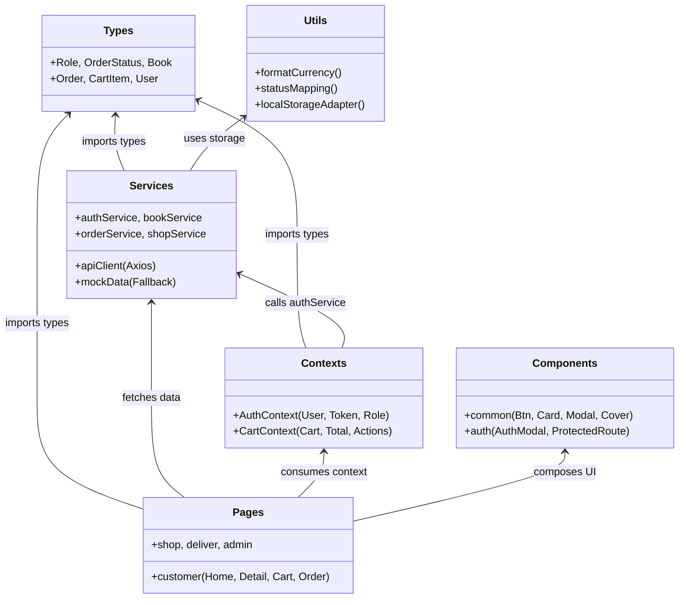
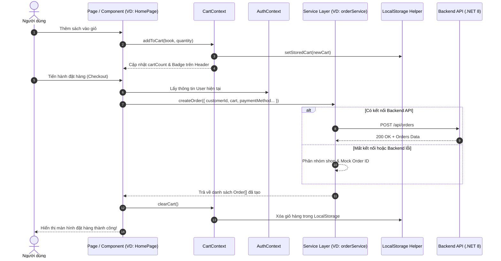

# BOOKVERSE FRONTEND - TÀI LIỆU KIẾN TRÚC VÀ HƯỚNG DẪN TÍCH HỢP HỆ THỐNG

> **Tài liệu kỹ thuật nội bộ dành cho đội ngũ phát triển (Frontend & Fullstack Developers)**  
> **Phiên bản:** 1.0.0 | **Ngày cập nhật:** 2026-08-24  
> **Tác giả:** Senior Frontend Architect & Technical Lead  
> **Repository:** `BookVerse/Frontend`

---

## MỤC LỤC

1. [Tổng quan hiện trạng Project](#1-tổng-quan-hiện-trạng-project)
   - 1.1. Mục đích & Phạm vi nghiệp vụ
   - 1.2. Danh mục tính năng & Màn hình (`src/pages/` & `src/components/`)
2. [Phân tích Cấu trúc Thư mục (Folder Architecture Review)](#2-phân-tích-cấu-trúc-thư-mục-folder-architecture-review)
   - 2.1. Cây thư mục trực quan
   - 2.2. Trách nhiệm cụ thể của từng Module
   - 2.3. Đánh giá theo tiêu chuẩn công nghiệp (Clean Architecture & Trade-offs)
3. [Luồng Dữ liệu & Quản lý Trạng thái (State Management & Data Flow)](#3-luồng-dữ-liệu--quản-lý-trạng-thái-state-management--data-flow)
   - 3.1. Sơ đồ luồng dữ liệu tổng thể
   - 3.2. Cơ chế truyền tải dữ liệu và lưu trữ cục bộ (LocalStorage)
   - 3.3. Đánh giá mô hình dữ liệu TypeScript (`src/types/index.ts`)
4. [Hướng dẫn chi tiết: Tích hợp và Kết nối Backend](#4-hướng-dẫn-chi-tiết-tích-hợp-và-kết-nối-backend)
   - 4.1. Quản lý biến môi trường với Vite (`.env`)
   - 4.2. Cấu hình Axios Client chuẩn công nghiệp (Interceptors & Error Handling)
   - 4.3. Mẫu Service Layer & Triển khai trong Component
   - 4.4. Cấu hình Reverse Proxy trong `vite.config.js` giải quyết triệt để CORS
5. [Lộ trình Nâng cấp Mã nguồn (Actionable Next Steps)](#5-lộ-trình-nâng-cấp-mã-nguồn-actionable-next-steps)
   - 5.1. Nâng cấp hệ thống Routing sang React Router DOM v6/v7
   - 5.2. Tích hợp TanStack Query (React Query) quản lý Server State & Caching
   - 5.3. Checklist lộ trình thực hiện theo giai đoạn

---

## 1. TỔNG QUAN HIỆN TRẠNG PROJECT

### 1.1. Mục đích & Phạm vi nghiệp vụ

**BookVerse** là một nền tảng thương mại điện tử chuyên ngành sách theo mô hình **Đa Cửa Hàng (Multi-vendor Marketplace)**. Ứng dụng giải quyết bài toán giao thương sách toàn diện với sự tham gia của 4 nhóm vai trò (Roles):

```
┌────────────────────────────────────────────────────────────────────────┐
│                        HỆ SINH THÁI BOOKVERSE                          │
└───────┬─────────────────┬──────────────────┬───────────────────┬───────┘
        │                 │                  │                   │
        ▼                 ▼                  ▼                   ▼
┌──────────────┐  ┌──────────────┐   ┌───────────────┐   ┌───────────────┐
│   CUSTOMER   │  │  SHOP/VENDOR │   │    DELIVER    │   │     ADMIN     │
│ (Khách hàng) │  │  (Nhà sách)  │   │  (Giao vận)   │   │  (Quản trị)   │
└──────────────┘  └──────────────┘   └───────────────┘   └───────────────┘
```

1. **Customer (Khách mua sách):** Khám phá sách, tìm kiếm, lọc danh mục, giỏ hàng đa nhà bán, checkout gom nhóm đơn hàng, theo dõi lộ trình giao hàng (GHN API), đánh giá sao & phản hồi, gửi yêu cầu khiếu nại/hoàn tiền.
2. **Shop / Vendor (Chủ nhà sách):** Tiếp nhận đơn hàng mới, xác nhận đóng gói, bàn giao shipper, quản trị tồn kho và đăng tải sách mới.
3. **Deliver (Nhân viên giao hàng):** Điều phối đơn từ GHN Hub, tiếp nhận đơn, liên hệ khách hàng, cập nhật chu kỳ vận chuyển (Chờ lấy ➔ Đang vận chuyển ➔ Đang giao ➔ Giao thành công).
4. **Admin (Quản trị viên nền tảng):** Giám sát toàn sàn, xem biểu đồ doanh thu, quản lý danh sách đơn hàng & tài khoản người dùng, đối soát giao dịch tài chính, xét duyệt yêu cầu hoàn trả & hoàn tiền (*Refunds*).

---

### 1.2. Danh mục tính năng & Màn hình (`src/pages/` & `src/components/`)

#### A. Phân hệ màn hình (`src/pages/`)

| Phân hệ / Tệp tin | Trách nhiệm & Tính năng chính |
| :--- | :--- |
| **Customer Pages** (`src/pages/customer/`) | |
| 📄 `HomePage.tsx` | - Thanh tìm kiếm đa năng (Tên sách, tác giả, nhà xuất bản, tên shop)<br>- Bộ lọc danh mục dạng tabs linh hoạt<br>- Banner quảng bá & Gian hàng đối tác nổi bật (`FeaturedShops`)<br>- Lưới sách hiển thị bìa gradient tự động, rating, số lượng đánh giá, giá niêm yết, nhãn hết hàng. |
| 📄 `BookDetailPage.tsx` | - Chi tiết thông số sách, nhà phát hành, đơn vị cung cấp (Shop)<br>- Quản lý số lượng mua (`+`/`-`), kiểm soát tồn kho (`stock`)<br>- Thêm vào giỏ hàng với hiệu ứng phản hồi<br>- Danh sách đánh giá & nhận xét thực tế từ người mua trước. |
| 📄 `CartPage.tsx` | - Hiển thị giỏ hàng đa nhà bán (Multi-shop Cart)<br>- Điều chỉnh số lượng hoặc xóa từng sản phẩm<br>- Bảng tóm tắt tài chính (Tạm tính tiền sách + Phí giao hàng GHN). |
| 📄 `CheckoutPage.tsx` | - Thu thập địa chỉ giao hàng và thông tin liên lạc<br>- Lựa chọn hình thức thanh toán: Trực tuyến (VNPAY/MoMo) hoặc COD<br>- Tự động phân nhóm và tạo các đơn hàng riêng biệt theo từng Shop (`shopGroups`). |
| 📄 `MyOrdersPage.tsx` | - Danh sách lịch sử đơn hàng của khách hàng hiện tại<br>- Hiển thị tóm tắt bìa sách, số lượng kiện hàng, tổng tiền, mã vận đơn GHN Express. |
| 📄 `OrderDetailPage.tsx` | - Chi tiết toàn bộ đơn hàng và các đầu sách đã mua<br>- Thanh tiến trình 4 giai đoạn giao hàng thực tế (*GHN Tracker*)<br>- Form đánh giá sao ⭐ và bình luận sau khi nhận sách<br>- Hộp thoại gửi yêu cầu hoàn tiền / đổi trả sách khi gặp sự cố (`ReturnRequest`). |
| **Shop Pages** (`src/pages/shop/`) | |
| 📄 `ShopDashboardPage.tsx` | - Thống kê KPI gian hàng (Doanh thu thực nhận, tổng đơn, đơn chờ xử lý, tổng đầu sách)<br>- Tab Quản lý đơn hàng: Duyệt đơn `PENDING` ➔ `PROCESSING` ➔ `SHIPPED`<br>- Tab Kho sách: Quản lý danh mục sách hiện có<br>- Modal thêm tựa sách mới với công cụ phối màu bìa gradient trực tiếp. |
| **Deliver Pages** (`src/pages/deliver/`) | |
| 📄 `DeliverDashboardPage.tsx` | - Danh sách điều phối công việc giao hàng hàng ngày<br>- Thông tin khách hàng, số điện thoại (hỗ trợ bấm gọi ngay `tel:`), địa chỉ, khối lượng kiện hàng<br>- Nút chuyển tiếp trạng thái 1-chạm: *Lấy hàng tại Shop ➔ Bắt đầu đi giao ➔ Đã giao thành công*. |
| **Admin Pages** (`src/pages/admin/`) | |
| 📄 `AdminDashboardPage.tsx` | - **Tab Tổng quan:** Thống kê doanh thu toàn sàn, tổng tiền hoàn trả, biểu đồ phân bổ trạng thái đơn<br>- **Tab Đơn hàng:** Bảng giám sát toàn bộ đơn hàng trên sàn<br>- **Tab Hoàn hàng & Đổi trả:** Xét duyệt / Từ chối yêu cầu hoàn tiền từ khách hàng, tự động hạch toán giao dịch `REFUND`<br>- **Tab Lịch sử giao dịch:** Đối soát dòng tiền chi tiết kèm mã giao dịch ngân hàng/cổng thanh toán<br>- **Tab Người dùng:** Quản lý danh sách tài khoản khách hàng, shop, shipper, admin. |

#### B. Phân hệ thành phần giao diện (`src/components/`)

| Thư mục | Component | Mô tả chức năng |
| :--- | :--- | :--- |
| `components/common/` | `Header.tsx` | Header cố định: Brand BookVerse, navigation, nút giỏ hàng (kèm badge số lượng), menu chuyển đổi vai trò Demo (*Role Switcher*), menu tài khoản người dùng. |
| | `Footer.tsx` | Footer chứa chính sách, thông tin đối tác, bản quyền và hỗ trợ khách hàng. |
| | `BookCover.tsx` | Component render bìa sách vector linh hoạt theo 3 kích cỡ (`sm`, `md`, `lg`) sử dụng CSS linear gradient động dựa trên `coverColor` & `coverColor2`. |
| | `Btn.tsx` | Nút bấm chuẩn hoá với các biến thể (`primary`, `outline`, `ghost`, `danger`), các kích thước (`sm`, `md`, `lg`) và trạng thái `loading`/`disabled`. |
| | `Card.tsx` | Khung thẻ chứa nội dung chuẩn Design System (bo góc `rounded-2xl`, viền `border-slate-200`, đổ bóng mềm). |
| | `StatCard.tsx` | Thẻ hiển thị chỉ số thống kê (KPIs) tích hợp icon, giá trị nổi bật và ghi chú phụ. |
| | `Badge.tsx` | Nhãn trạng thái đa năng (Status Badge) tự động đổi màu chữ, màu nền và icon. |
| | `Modal.tsx` | Hộp thoại tương tác nổi (Dialog Modal) kèm backdrop mờ (`backdrop-blur-sm`), nút đóng `X` và hiệu ứng xuất hiện `animate-in`. |
| `components/auth/` | `AuthModal.tsx` | Modal Đăng nhập / Đăng ký tài khoản hỗ trợ JWT Token và danh sách nút chọn nhanh tài khoản Demo theo từng Role. |
| | `ProtectedRoute.tsx` | Component bọc bảo vệ quyền truy cập (Route Guard) dựa trên vai trò `role` của người dùng. |
| `components/customer/`| `FeaturedShops.tsx` | Danh sách đối tác nhà sách uy tín trên trang chủ (Nhã Nam, Kim Đồng, Omega Plus, Trí Việt). |

---

## 2. PHÂN TÍCH CẤU TRÚC THƯ MỤC (FOLDER ARCHITECTURE REVIEW)

### 2.1. Cây thư mục trực quan

```text
Frontend/
├── README.md                           # Giới thiệu tổng quan hệ thống BookVerse
├── PROJECT_STRUCTURE_AND_GUIDE.md      # [Tài liệu này] Kiến trúc & Hướng dẫn kỹ thuật
└── Frontend/                           # Root Source Code ứng dụng React Vite
    ├── index.html                      # Entry HTML Template
    ├── package.json                    # Khai báo Dependencies & Scripts
    ├── postcss.config.js               # Cấu hình PostCSS cho Tailwind
    ├── tailwind.config.js              # Cấu hình Theme, Màu sắc, Fonts
    ├── vite.config.js                  # Cấu hình Vite Bundler & Server
    ├── public/                         # Static Assets tĩnh không qua bundler
    └── src/
        ├── main.jsx                    # Root Mounting Point
        ├── App.tsx                     # Top-level Routing & State Switcher
        ├── index.css                   # Global CSS & Tailwind Directives
        ├── assets/                     # Hình ảnh, icons tĩnh (hero.png, svg)
        ├── types/
        │   └── index.ts                # TypeScript Interfaces, Types, Enums
        ├── contexts/
        │   ├── AuthContext.tsx         # Authentication & Authorization Context
        │   └── CartContext.tsx         # Shopping Cart State Context
        ├── services/
        │   ├── api.ts                  # Axios Client Base & Interceptors
        │   ├── authService.ts          # Auth API & Local Auth Fallback
        │   ├── bookService.ts          # Sách & Danh mục API
        │   ├── orderService.ts         # Đơn hàng, Feedback, Return API
        │   ├── shopService.ts          # Kênh người bán API
        │   ├── deliverService.ts       # Kênh vận chuyển API
        │   ├── adminService.ts         # Kênh quản trị sàn API
        │   └── mockData.ts             # Cơ sở dữ liệu mẫu độc lập
        ├── components/
        │   ├── common/                 # Reusable Base UI Components
        │   ├── auth/                   # Authentication Components & Route Guards
        │   └── customer/               # Customer Specialized Components
        ├── pages/
        │   ├── customer/               # 6 Màn hình Khách hàng
        │   ├── shop/                   # 1 Màn hình Dashboard Nhà sách
        │   ├── deliver/                # 1 Màn hình Dashboard Vận chuyển
        │   └── admin/                  # 1 Màn hình Dashboard Quản trị
        ├── styles/
        │   ├── fonts.css               # Typography Imports (Inter, JetBrains Mono)
        │   └── theme.css               # CSS Variables & Color Tokens
        └── utils/
            ├── format.ts               # Định dạng tiền tệ VNĐ, ngày tháng
            ├── status.tsx              # Mapping màu sắc/nhãn trạng thái
            └── storage.ts              # LocalStorage Helper (Tokens, Users, Cart)
```

---

### 2.2. Trách nhiệm cụ thể của từng Module



- **`types/`**: Đóng vai trò là "Single Source of Truth" về cấu trúc dữ liệu cho toàn bộ ứng dụng. Không chứa logic runtime.
- **`utils/`**: Các hàm tính toán thuần túy (Pure Functions), không phụ thuộc vào React Component (format số tiền, mapping icon/màu sắc theo status, get/set LocalStorage an toàn với kiểu `JSON.parse`).
- **`services/`**: Tầng giao tiếp mạng (Network Layer). Cô lập toàn bộ lời gọi Axios, URL endpoint và cơ chế fallback mock dữ liệu, giúp Pages không cần biết chi tiết HTTP request được thực hiện ra sao.
- **`contexts/`**: Quản lý State mang tính toàn cục (Global State) cần chia sẻ đa màn hình như phiên người dùng (`AuthContext`) và giỏ hàng (`CartContext`).
- **`components/`**: Các thành phần giao diện không gắn chặt với một trang cụ thể, tuân thủ nguyên lý tái sử dụng (*Reusable & Presentational Components*).
- **`pages/`**: Nơi ghép nối các UI components, lắng nghe event, tương tác với services và contexts để hình thành màn hình hoàn chỉnh.

---

### 2.3. Đánh giá theo tiêu chuẩn công nghiệp (Clean Architecture Review)

#### ✅ Điểm mạnh nổi bật:
1. **Phân tách trách nhiệm (Separation of Concerns):** Tầng giao diện (`pages/components`) tách biệt hoàn toàn với tầng dữ liệu (`services/api`).
2. **Cơ chế Graceful Degradation (Fallback Mock):** Tất cả service method đều bọc trong `try/catch`. Khi Backend API chưa khởi chạy, ứng dụng tự động fallback về `mockData.ts`, đảm bảo dev/demo mượt mà 100% không bị crash.
3. **Role-based Theming & Access Control:** Màu sắc nhận diện vai trò (`ROLE_COLORS`) và `ProtectedRoute` được chuẩn hóa, hỗ trợ chuyển đổi vai trò trực tiếp trên giao diện để phục vụ kiểm thử.
4. **Strong Typing:** 100% mã nguồn được định kiểu rõ ràng với TypeScript, không xuất hiện kiểu `any` tùy tiện.

#### ⚠️ Điểm cần cải tiến & Tối ưu hóa:
1. **Mô hình Điều hướng (Routing Bottleneck):** Hiện tại `App.tsx` đang quản lý chuyển trang bằng State nội bộ (`customerPage === 'home'`, `role === 'shop'`).
   - *Hạn chế:* Không có URL thực tế trên thanh địa chỉ, không hỗ trợ bấm nút Back/Forward của trình duyệt, không chia sẻ được link cụ thể (Deep Linking) và không tối ưu cho SEO.
2. **Mô hình Layer-based thuần túy khi mở rộng:** Khi dự án phát triển từ 10 lên 50 màn hình, việc gom tất cả services vào một folder `services/` sẽ gây quá tải (*Cognitive Load*). Nên chuẩn bị lộ trình chuyển dần sang **Feature-based Architecture** (ví dụ: `src/features/books/`, `src/features/orders/`).
3. **Quản lý Server State thủ công:** Các trang đang dùng `useState + useEffect + setLoading` độc lập để fetch dữ liệu, dễ dẫn đến trùng lặp mã nguồn và thiếu cơ chế Caching thông minh.

---

## 3. LUỒNG DỮ LIỆU & QUẢN LÝ TRẠNG THÁI (STATE MANAGEMENT & DATA FLOW)

### 3.1. Sơ đồ luồng dữ liệu tổng thể



---

### 3.2. Cơ chế truyền tải dữ liệu và lưu trữ cục bộ

1. **Phiên đăng nhập (`AuthContext`):**
   - Đọc trạng thái ban đầu từ `localStorage` thông qua các helper `getStoredToken()` và `getStoredUser()`.
   - Cung cấp hàm `login()`, `logout()`, `register()`, và `switchRole()` cho toàn cây component.
   - Khi có sự thay đổi vai trò, `AuthContext` cập nhật User và đồng thời thông báo tới `App.tsx` để render giao diện phù hợp.

2. **Giỏ hàng (`CartContext`):**
   - Lưu trữ mảng `CartItem[]` bao gồm đối tượng `book` và `quantity`.
   - Tự động tính toán các giá trị phái sinh (*Derived State*): `cartCount`, `subtotal`, `shippingFee` (30,000đ nếu có sản phẩm), `total`.
   - Lắng nghe sự thay đổi của `cart` qua `useEffect` để đồng bộ tự động vào `localStorage` với key `bookverse_cart`.

3. **Truyền Props & Callbacks giữa Pages và UI Base Components:**
   - Các UI Component (`Btn`, `Card`, `Badge`, `BookCover`, `Modal`) hoàn toàn là **Stateless / Controlled Components**, nhận data qua Props và bắn sự kiện ngược lên qua Callbacks (ví dụ `onClick`, `onClose`).
   - Cách làm này đảm bảo tính tái sử dụng cao nhất và dễ dàng viết Unit Test độc lập.

---

### 3.3. Đánh giá mô hình dữ liệu TypeScript (`src/types/index.ts`)

File [`src/types/index.ts`](file:///Users/nguyenvanminhtam/Frontend/Frontend/src/types/index.ts) được thiết kế rất chặt chẽ, ánh xạ chuẩn xác với Database Domain:

```typescript
// 1. Union Types rõ ràng, tránh magic strings
export type Role = "customer" | "shop" | "admin" | "deliver";
export type OrderStatus = "PENDING" | "PAID" | "PROCESSING" | "SHIPPED" | "DELIVERED" | "CANCELLED" | "RETURNED";
export type PaymentMethod = "COD" | "ONLINE";
export type DeliveryStatus = "PENDING" | "TRANSIT" | "OUT_FOR_DELIVERY" | "DELIVERED" | "RETURNED";
export type ReturnStatus = "PENDING" | "APPROVED" | "REJECTED";

// 2. Data Interfaces đầy đủ quan hệ thực thể
export interface Book { ... }
export interface Order { ... }
export interface Transaction { ... }
export interface DeliveryTask { ... }
export interface User { ... }
```

> **💡 Đề xuất mở rộng:** Khi kết nối Backend chính thức, nên bổ sung thêm các generic type cho API Response để chuẩn hóa:
> ```typescript
> export interface ApiResponse<T> {
>   success: boolean;
>   data: T;
>   message?: string;
>   errors?: string[];
> }
> 
> export interface PaginatedResponse<T> {
>   items: T[];
>   pageIndex: number;
>   pageSize: number;
>   totalCount: number;
>   totalPages: number;
> }
> ```

---

## 4. HƯỚNG DẪN CHI TIẾT: TÍCH HỢP VÀ KẾT NỐI BACKEND

### 4.1. Quản lý biến môi trường với Vite (`.env`)

Vite yêu cầu tất cả các biến môi trường muốn sử dụng ở Client-side **bắt buộc phải có tiền tố `VITE_`**.

#### Bước 1: Tạo file cấu hình môi trường

Tạo file `.env.example` để làm mẫu cho toàn đội ngũ và file `.env.development` để chạy cục bộ tại thư mục `Frontend/Frontend/`:

##### `.env.example`
```properties
# Backend API Base URL (.NET 8 Web API)
VITE_API_URL=http://localhost:5000/api

# External Service Keys (Nếu có)
VITE_APP_TITLE=BookVerse Marketplace
VITE_ENABLE_MOCK=false
```

##### `.env.development`
```properties
VITE_API_URL=http://localhost:5000/api
VITE_ENABLE_MOCK=false
```

##### `.env.production`
```properties
VITE_API_URL=https://api.bookverse.com/api
VITE_ENABLE_MOCK=false
```

#### Bước 2: Thêm `.env*.local` vào `.gitignore`
Đảm bảo các file chứa secret thực tế không bị commit:
```gitignore
# local env files
.env.local
.env.development.local
.env.test.local
.env.production.local
```

#### Bước 3: Đọc biến môi trường an toàn trong TypeScript
Tạo file `src/utils/env.ts` để có Intellisense và kiểm tra kiểu:
```typescript
export const ENV = {
  API_URL: import.meta.env.VITE_API_URL || "http://localhost:5000/api",
  IS_DEV: import.meta.env.DEV,
  IS_PROD: import.meta.env.PROD,
};
```

---

### 4.2. Cấu hình Axios Client chuẩn công nghiệp (Interceptors & Error Handling)

Dưới đây là cấu hình chuẩn cho `src/services/apiClient.ts` xử lý tự động JWT Bearer Token, làm mới token nếu cần, và gom nhóm xử lý lỗi HTTP tập trung:

```typescript
// src/services/apiClient.ts
import axios, { AxiosError, InternalAxiosRequestConfig } from "axios";
import { getStoredToken, removeStoredToken } from "../utils/storage";

const API_BASE_URL = import.meta.env.VITE_API_URL || "http://localhost:5000/api";

export const apiClient = axios.create({
  baseURL: API_BASE_URL,
  headers: {
    "Content-Type": "application/json",
    "Accept": "application/json",
  },
  timeout: 15000, // 15 giây timeout
});

// 1. Request Interceptor: Tự động gắn Bearer JWT Token vào Header
apiClient.interceptors.request.use(
  (config: InternalAxiosRequestConfig) => {
    const token = getStoredToken();
    if (token && config.headers) {
      config.headers.Authorization = `Bearer ${token}`;
    }
    return config;
  },
  (error: AxiosError) => Promise.reject(error)
);

// 2. Response Interceptor: Bắt lỗi tập trung và xử lý phản hồi
apiClient.interceptors.response.use(
  (response) => {
    // Trả về dữ liệu thành công
    return response;
  },
  (error: AxiosError<{ message?: string; errors?: Record<string, string[]> }>) => {
    if (error.response) {
      const { status, data } = error.response;

      switch (status) {
        case 401:
          // Hết hạn phiên đăng nhập hoặc Token không hợp lệ
          console.warn("[HTTP 401] Token expired or Unauthorized. Clearing credentials...");
          removeStoredToken();
          // Có thể kích hoạt sự kiện global hoặc redirect về trang đăng nhập
          break;

        case 403:
          console.error("[HTTP 403] Forbidden: Bạn không có quyền thực hiện hành động này.");
          break;

        case 404:
          console.warn("[HTTP 404] Resource not found:", error.config?.url);
          break;

        case 422:
        case 400:
          console.error("[HTTP 400/422] Validation Error:", data?.message || data?.errors);
          break;

        case 500:
        case 502:
        case 503:
          console.error("[HTTP 5xx] Lỗi máy chủ Backend. Vui lòng thử lại sau.");
          break;

        default:
          console.error(`[HTTP ${status}] Có lỗi xảy ra:`, data?.message);
      }
    } else if (error.request) {
      console.error("[Network Error] Không thể kết nối tới máy chủ API. Kiểm tra kết nối mạng hoặc CORS.");
    }

    return Promise.reject(error);
  }
);
```

---

### 4.3. Mẫu Service Layer & Triển khai trong Component

#### Bước 1: Viết Service với Clean Interface (`src/services/bookService.ts`)

```typescript
// src/services/bookService.ts
import { apiClient } from "./apiClient";
import { Book, Category } from "../types";
import { INITIAL_BOOKS, INITIAL_CATEGORIES } from "./mockData";

export interface BookFilterParams {
  search?: string;
  categoryId?: number;
  minPrice?: number;
  maxPrice?: number;
  shopId?: number;
}

export const bookService = {
  // Lấy danh sách danh mục
  async getCategories(): Promise<Category[]> {
    try {
      const res = await apiClient.get<Category[]>("/categories");
      return res.data;
    } catch (err) {
      console.warn("Using fallback categories mock data", err);
      return INITIAL_CATEGORIES;
    }
  },

  // Lấy danh sách sách kèm bộ lọc
  async getBooks(params?: BookFilterParams): Promise<Book[]> {
    try {
      const res = await apiClient.get<Book[]>("/books", { params });
      return res.data;
    } catch (err) {
      console.warn("Using fallback books mock data", err);
      let list = INITIAL_BOOKS;
      if (params?.categoryId) {
        list = list.filter((b) => b.categoryId === params.categoryId);
      }
      if (params?.search) {
        const q = params.search.toLowerCase();
        list = list.filter(
          (b) =>
            b.title.toLowerCase().includes(q) ||
            b.author.toLowerCase().includes(q) ||
            b.shopName.toLowerCase().includes(q)
        );
      }
      return list;
    }
  },

  // Lấy chi tiết một cuốn sách
  async getBookById(id: number): Promise<Book | null> {
    try {
      const res = await apiClient.get<Book>(`/books/${id}`);
      return res.data;
    } catch (err) {
      console.warn(`Using fallback for book id ${id}`, err);
      return INITIAL_BOOKS.find((b) => b.id === id) || null;
    }
  },

  // Tạo sách mới (Dành cho Vendor/Shop)
  async createBook(payload: Omit<Book, "id">): Promise<Book> {
    try {
      const res = await apiClient.post<Book>("/books", payload);
      return res.data;
    } catch (err) {
      console.warn("Mocking book creation", err);
      const created: Book = { ...payload, id: Date.now() };
      return created;
    }
  },
};
```

#### Bước 2: Gọi Service trong Component kèm Loading, Error, Empty State

```tsx
// Ví dụ: Triển khai trong một Component hiển thị danh sách sách
import React, { useState, useEffect, useCallback } from "react";
import { Book, Category } from "../../types";
import { bookService } from "../../services/bookService";
import { BookCover } from "../../components/common/BookCover";
import { fmt } from "../../utils/format";
import { AlertCircle, RefreshCw } from "lucide-react";

export const BookListSection: React.FC = () => {
  const [books, setBooks] = useState<Book[]>([]);
  const [loading, setLoading] = useState<boolean>(true);
  const [error, setError] = useState<string | null>(null);

  const fetchBooks = useCallback(async () => {
    setLoading(true);
    setError(null);
    try {
      const data = await bookService.getBooks();
      setBooks(data);
    } catch (err: any) {
      setError(err?.message || "Không thể tải danh sách sách. Vui lòng thử lại.");
    } finally {
      setLoading(false);
    }
  }, []);

  useEffect(() => {
    fetchBooks();
  }, [fetchBooks]);

  // 1. Loading State (Skeletons)
  if (loading) {
    return (
      <div className="grid grid-cols-2 sm:grid-cols-4 gap-4">
        {[1, 2, 3, 4].map((i) => (
          <div key={i} className="bg-white rounded-2xl p-4 h-72 animate-pulse border border-slate-200" />
        ))}
      </div>
    );
  }

  // 2. Error State
  if (error) {
    return (
      <div className="p-6 rounded-2xl bg-red-50 border border-red-200 text-center">
        <AlertCircle size={32} className="mx-auto text-red-500 mb-2" />
        <p className="text-sm font-semibold text-red-700">{error}</p>
        <button
          onClick={fetchBooks}
          className="mt-3 inline-flex items-center gap-1.5 px-4 py-2 rounded-xl bg-red-600 text-white text-xs font-semibold hover:bg-red-700 transition-colors"
        >
          <RefreshCw size={13} /> Thử lại
        </button>
      </div>
    );
  }

  // 3. Empty State
  if (books.length === 0) {
    return (
      <div className="p-12 text-center bg-white rounded-2xl border border-slate-200 text-slate-400">
        Hiện chưa có cuốn sách nào.
      </div>
    );
  }

  // 4. Data State
  return (
    <div className="grid grid-cols-2 sm:grid-cols-4 gap-4">
      {books.map((book) => (
        <div key={book.id} className="bg-white rounded-2xl border border-slate-200 p-3 hover:shadow-md transition-all">
          <BookCover book={book} size="md" />
          <h3 className="font-bold text-sm text-slate-800 mt-2 line-clamp-1">{book.title}</h3>
          <p className="text-xs text-slate-400">{book.author}</p>
          <p className="text-sm font-extrabold text-blue-600 mt-1">{fmt(book.price)}</p>
        </div>
      ))}
    </div>
  );
};
```

---

### 4.4. Cấu hình Reverse Proxy trong `vite.config.js` giải quyết triệt để CORS

Khi phát triển tại máy cá nhân (Frontend chạy ở `http://localhost:5173`, Backend ASP.NET Core chạy ở `http://localhost:5000` hoặc `https://localhost:7001`), trình duyệt sẽ chặn request do vi phạm chính sách **CORS (Cross-Origin Resource Sharing)**.

Thay vì phải cấu hình phức tạp ở Backend, ta sử dụng tính năng **Reverse Proxy của Vite Dev Server**:

##### Cập nhật file `Frontend/Frontend/vite.config.js`:

```javascript
import { defineConfig } from 'vite';
import react from '@vitejs/plugin-react';

export default defineConfig({
  plugins: [react()],
  server: {
    port: 5173,
    open: true, // Tự động mở trình duyệt khi chạy npm run dev
    proxy: {
      // Bất kỳ request nào bắt đầu bằng /api sẽ được chuyển tiếp ngầm tới Backend
      '/api': {
        target: 'http://localhost:5000', // URL của Backend .NET 8 Web API
        changeOrigin: true,
        secure: false, // Bỏ qua SSL certificate tự ký ở môi trường development
        rewrite: (path) => path, // Giữ nguyên đường dẫn /api/...
      },
    },
  },
});
```

> **⚡ Lợi ích:** Khi cấu hình proxy, ở Frontend biến `VITE_API_URL` chỉ cần đặt là `/api`. Trình duyệt sẽ hiểu là gọi cùng origin `http://localhost:5173/api`, Vite dev server sẽ đứng ra chuyển tiếp request đến `http://localhost:5000/api`, giải quyết triệt để 100% lỗi CORS.

---

## 5. LỘ TRÌNH NÂNG CẤP MÃ NGUỒN (ACTIONABLE NEXT STEPS)

### 5.1. Nâng cấp hệ thống Routing sang React Router DOM v6/v7

#### Bước 1: Cài đặt thư viện
```bash
npm install react-router-dom
```

#### Bước 2: Thiết kế sơ đồ Route chuẩn RESTful

| Đường dẫn (Route Path) | Component Màn hình | Quyền truy cập (Role Guard) |
| :--- | :--- | :--- |
| `/` | `HomePage` | Public (Khách hàng) |
| `/books/:id` | `BookDetailPage` | Public (Khách hàng) |
| `/cart` | `CartPage` | Public (Khách hàng) |
| `/checkout` | `CheckoutPage` | Yêu cầu đăng nhập |
| `/orders` | `MyOrdersPage` | Yêu cầu đăng nhập (`customer`) |
| `/orders/:id` | `OrderDetailPage` | Yêu cầu đăng nhập (`customer`) |
| `/shop/dashboard` | `ShopDashboardPage` | Yêu cầu vai trò `shop` |
| `/deliver/dashboard`| `DeliverDashboardPage`| Yêu cầu vai trò `deliver` |
| `/admin/dashboard` | `AdminDashboardPage` | Yêu cầu vai trò `admin` |
| `*` | `NotFoundPage` | Public |

#### Bước 3: Cấu trúc tệp tin Router mẫu (`src/routes/AppRoutes.tsx`)

```tsx
// src/routes/AppRoutes.tsx
import React from "react";
import { createBrowserRouter, RouterProvider, Outlet } from "react-router-dom";
import { Header } from "../components/common/Header";
import { Footer } from "../components/common/Footer";
import { ProtectedRoute } from "../components/auth/ProtectedRoute";

// Customer Pages
import { HomePage } from "../pages/customer/HomePage";
import { BookDetailPage } from "../pages/customer/BookDetailPage";
import { CartPage } from "../pages/customer/CartPage";
import { CheckoutPage } from "../pages/customer/CheckoutPage";
import { MyOrdersPage } from "../pages/customer/MyOrdersPage";
import { OrderDetailPage } from "../pages/customer/OrderDetailPage";

// Other Roles
import { ShopDashboardPage } from "../pages/shop/ShopDashboardPage";
import { AdminDashboardPage } from "../pages/admin/AdminDashboardPage";
import { DeliverDashboardPage } from "../pages/deliver/DeliverDashboardPage";

// Layout chung có Header & Footer
const RootLayout: React.FC = () => {
  return (
    <div className="min-h-screen flex flex-col bg-slate-100/70 text-slate-900">
      <Header />
      <main className="flex-1">
        <Outlet />
      </main>
      <Footer />
    </div>
  );
};

export const router = createBrowserRouter([
  {
    path: "/",
    element: <RootLayout />,
    children: [
      { index: true, element: <HomePage /> },
      { path: "books/:id", element: <BookDetailPage /> },
      { path: "cart", element: <CartPage /> },
      { path: "checkout", element: <CheckoutPage /> },
      { path: "orders", element: <MyOrdersPage /> },
      { path: "orders/:id", element: <OrderDetailPage /> },
      
      // Role Protected Routes
      {
        path: "shop",
        element: (
          <ProtectedRoute allowedRoles={["shop"]}>
            <ShopDashboardPage />
          </ProtectedRoute>
        ),
      },
      {
        path: "deliver",
        element: (
          <ProtectedRoute allowedRoles={["deliver"]}>
            <DeliverDashboardPage />
          </ProtectedRoute>
        ),
      },
      {
        path: "admin",
        element: (
          <ProtectedRoute allowedRoles={["admin"]}>
            <AdminDashboardPage />
          </ProtectedRoute>
        ),
      },
    ],
  },
]);

export const AppRoutes: React.FC = () => {
  return <RouterProvider router={router} />;
};
```

---

### 5.2. Tích hợp TanStack Query (React Query) quản lý Server State & Caching

TanStack Query giúp loại bỏ hoàn toàn các đoạn mã lặp lại `useState + useEffect + setLoading`, tự động cache dữ liệu và tái xác thực dữ liệu nền (*Background Stale-While-Revalidate*).

#### Bước 1: Cài đặt thư viện
```bash
npm install @tanstack/react-query @tanstack/react-query-devtools
```

#### Bước 2: Khởi tạo Query Client tại `src/main.jsx`
```tsx
import React from "react";
import ReactDOM from "react-dom/client";
import { QueryClient, QueryClientProvider } from "@tanstack/react-query";
import { ReactQueryDevtools } from "@tanstack/react-query-devtools";
import App from "./App";
import "./index.css";

const queryClient = new QueryClient({
  defaultOptions: {
    queries: {
      staleTime: 1000 * 60 * 5, // Cache dữ liệu 5 phút
      refetchOnWindowFocus: false, // Không tự refetch khi focus lại tab
      retry: 1, // Thử lại tối đa 1 lần nếu lỗi mạng
    },
  },
});

ReactDOM.createRoot(document.getElementById("root")!).render(
  <React.StrictMode>
    <QueryClientProvider client={queryClient}>
      <App />
      <ReactQueryDevtools initialIsOpen={false} />
    </QueryClientProvider>
  </React.StrictMode>
);
```

#### Bước 3: Viết Custom Query Hooks (`src/hooks/useBooks.ts`)

```typescript
// src/hooks/useBooks.ts
import { useQuery, useMutation, useQueryClient } from "@tanstack/react-query";
import { bookService, BookFilterParams } from "../services/bookService";
import { Book } from "../types";

// Hook lấy danh sách sách có caching
export const useBooks = (params?: BookFilterParams) => {
  return useQuery({
    queryKey: ["books", params],
    queryFn: () => bookService.getBooks(params),
  });
};

// Hook lấy chi tiết 1 cuốn sách
export const useBookDetail = (bookId: number) => {
  return useQuery({
    queryKey: ["book", bookId],
    queryFn: () => bookService.getBookById(bookId),
    enabled: !!bookId, // Chỉ chạy query khi có ID hợp lệ
  });
};

// Mutation tạo sách mới (Tự động xóa cache để refetch)
export const useCreateBook = () => {
  const queryClient = useQueryClient();
  return useMutation({
    mutationFn: (newBook: Omit<Book, "id">) => bookService.createBook(newBook),
    onSuccess: () => {
      // Invalidate query để UI tự động tải lại danh sách sách mới nhất
      queryClient.invalidateQueries({ queryKey: ["books"] });
    },
  });
};
```

---

### 5.3. Checklist lộ trình thực hiện theo giai đoạn (Implementation Roadmap)

```text
GIAI ĐOẠN 1: NỀN TẢNG & ROUTING (Ưu tiên cao)
[ ] Cài đặt `react-router-dom` và chuyển đổi toàn bộ `customerPage` sang URL thực tế (/books/:id, /orders/:id...).
[ ] Tạo `.env.development` và cấu hình reverse proxy trong `vite.config.js`.
[ ] Thử nghiệm điều hướng bằng Browser Back/Forward và kiểm tra Deep Linking.

GIAI ĐOẠN 2: TỐI ƯU STATE & KẾT NỐI BACKEND (Ưu tiên cao)
[ ] Cài đặt `@tanstack/react-query` và bọc `QueryClientProvider` tại root.
[ ] Chuyển đổi các lời gọi `bookService`, `orderService` sang Custom Hooks (`useBooks`, `useOrders`).
[ ] Khởi chạy Backend ASP.NET Core (.NET 8) và kiểm tra API Login, Register, Profile với JWT thật.
[ ] Kiểm thử luồng phân quyền `ProtectedRoute` khi token hết hạn (HTTP 401).

GIAI ĐOẠN 3: FORM VALIDATION & MEDIA (Ưu tiên trung bình)
[ ] Tích hợp `react-hook-form` + `zod` cho màn hình Checkout, Thêm sách và Đăng ký.
[ ] Bổ sung tính năng Upload ảnh thật (qua Cloudinary hoặc API Backend) thay cho gradient màu tạm thời.
[ ] Thêm bộ lọc nâng cao (Khoảng giá thanh trượt, đánh giá sao, khoảng cách địa lý).

GIAI ĐOẠN 4: TEST & DEPLOYMENT (Sẵn sàng Production)
[ ] Viết Unit Test cho các Utility Functions (`format.ts`, `storage.ts`) bằng Vitest.
[ ] Viết Component Test cho `BookCover`, `Btn`, `Card`, `Header`.
[ ] Kiểm tra Bundle size (`npm run build`) và cấu hình CI/CD triển khai tự động lên Vercel.
```

---

## 6. KẾT LUẬN

Mã nguồn **BookVerse Frontend** được xây dựng với chất lượng cao, cấu trúc thư mục rõ ràng, phân chia vai trò nghiệp vụ hoàn chỉnh và tuân thủ nghiêm ngặt chuẩn mực TypeScript. 

Việc thực hiện theo đúng tài liệu hướng dẫn và lộ trình nâng cấp trên sẽ giúp hệ thống dễ dàng kết nối với Backend .NET 8, mở rộng quy mô tính năng nhanh chóng và đảm bảo trải nghiệm người dùng tối ưu ở chuẩn mực ứng dụng thương mại điện tử chuyên nghiệp.
