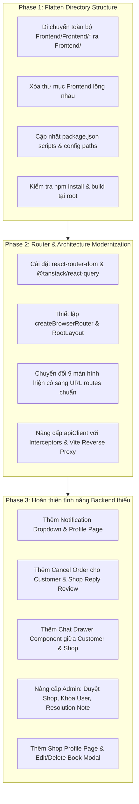

# ĐÁNH GIÁ ĐỘ BAO PHỦ TÍNH NĂNG BACKEND & KẾ HOẠCH REFACTOR TOÀN DIỆN BOOKVERSE FRONTEND

Tài liệu này gồm 2 phần chính:
1. **Bản Đánh Giá Ma Trận Tính Năng (Backend Function Coverage & Gap Analysis)**: So sánh chi tiết 44 API/Function của Backend với mã nguồn Frontend hiện tại.
2. **Kế Hoạch Refactor Toàn Diện (Comprehensive Refactoring Plan)**:
   - **Phase 1**: Làm phẳng cấu trúc thư mục (Flatten nested `Frontend/Frontend/` ➔ Thư mục gốc `Frontend/`).
   - **Phase 2**: Nâng cấp kiến trúc Router (`react-router-dom`), Layout và Network Layer (`apiClient`).
   - **Phase 3**: Bổ sung & hoàn thiện các màn hình/tính năng còn thiếu theo đặc tả Backend (Chat, Notifications, Shop Approval, Dispute Resolution, Profile, v.v.).

---

## PHẦN 1: MA TRẬN ĐÁNH GIÁ ĐỘ BAO PHỦ CHỨC NĂNG BACKEND

> **Ký hiệu đánh giá:**
> - ✅ **Đã hỗ trợ đầy đủ (Full Support)**: Đã có UI, State, Service và Type tương ứng.
> - ⚠️ **Hỗ trợ một phần (Partial Support)**: Đã có giao diện hoặc logic cơ bản nhưng thiếu trường dữ liệu, thiếu action hoặc chưa đầy đủ nghiệp vụ.
> - ❌ **Chưa hỗ trợ (Missing)**: Chưa có UI, Service hoặc Route cho tính năng này.

### 1. Phân hệ Chung (User - Customer, Shop, Delivery, Admin)

| STT | Function Backend | Mô tả nghiệp vụ | Trạng thái Frontend | Chi tiết hiện trạng & Điểm cần bổ sung |
| :---: | :--- | :--- | :---: | :--- |
| 1 | `Login()` | Đăng nhập tài khoản | ✅ | Đã có trong `AuthModal` + `authService.login()` |
| 2 | `Logout()` | Đăng xuất phiên làm việc | ✅ | Đã có trong `Header` + `authService.logout()` |
| 3 | `UpdateProfile()` | Cập nhật tên, phone, email, địa chỉ mặc định | ⚠️ | Mới có form điền thông tin lúc checkout; **chưa có trang Quản lý Profile cá nhân riêng**. |
| 4 | `Register()` | Đăng ký tài khoản | ✅ | Đã có trong `AuthModal` + `authService.register()` |
| 5 | `VerifyEmail()` | Xác thực email đăng ký | ❌ | Chưa có UI xác thực OTP/Link email kích hoạt. |
| 6 | `GetAllBook()` | Lấy danh sách toàn bộ sách mở bán | ✅ | Đã có `HomePage` + `bookService.getBooks()` |
| 7 | `GetDetailBook()` | Xem chi tiết 1 cuốn sách | ✅ | Đã có `BookDetailPage` + `bookService.getBookById()` |
| 8 | `GetTransactionHistory()` | Xem lịch sử nạp/chi/hoàn tiền | ⚠️ | Mới có bảng giao dịch ở trang Admin; **Customer chưa có trang xem lịch sử giao dịch/ví tiền cá nhân**. |
| 9 | `GetNotifications()` | Nhận thông báo hệ thống | ⚠️ | Có icon chuông thông báo trên `Header` nhưng chưa có popup/dropdown danh sách thông báo thực tế. |
| 10 | `ReadNotification()` | Đánh dấu đã đọc thông báo | ❌ | Chưa có UI / Service xử lý. |
| 11 | `ForgotPassword()` & `ResetPassword()` | Quên mật khẩu & Đặt lại mật khẩu | ❌ | Chưa có form Quên mật khẩu trên `AuthModal`. |
| 12 | `Chat()` | Nhắn tin thời gian thực | ❌ | Chưa có Widget/Khung Chat giữa Customer và Shop. |
| 13 | `GetAllOrderByUser()` | Xem đơn hàng theo User (Customer xem đơn mua, Shop xem đơn bán) | ✅ | Đã có `MyOrdersPage` (Customer) và `ShopDashboardPage` (Shop). |

---

### 2. Phân hệ Khách hàng (Customer)

| STT | Function Backend | Mô tả nghiệp vụ | Trạng thái Frontend | Chi tiết hiện trạng & Điểm cần bổ sung |
| :---: | :--- | :--- | :---: | :--- |
| 1 | `FindBook()` | Tìm kiếm sách (tên, tác giả, shop) | ✅ | Đã có thanh Search trên `HomePage`. |
| 2 | `ViewBookFeedbacks()` | Xem đánh giá kèm phản hồi của chủ Shop | ⚠️ | `BookDetailPage` đã hiện đánh giá nhưng **chưa hiển thị phần phản hồi (Response) của Shop**. |
| 3 | `AddToCart()` | Thêm vào giỏ hàng | ✅ | Đã có `CartContext` + `BookDetailPage`. |
| 4 | `DeleteFromCard()` | Xóa món khỏi giỏ | ✅ | Đã có nút xóa trên `CartPage`. |
| 5 | `OrderBook()` | Đặt hàng | ✅ | Đã có `CheckoutPage` + `orderService.createOrder()`. |
| 6 | `Payment()` | Thanh toán (VNPAY / COD) | ✅ | Đã có lựa chọn hình thức trên `CheckoutPage`. |
| 7 | `FilterOrderByStatus()` | Lọc đơn hàng theo trạng thái | ⚠️ | `MyOrdersPage` hiển thị tất cả; **cần thêm tabs lọc (Chờ xử lý, Đang giao, Đã giao, Đã hủy)**. |
| 8 | `ViewOrderDetail()` | Xem chi tiết đơn hàng & lộ trình GHN | ✅ | Đã có `OrderDetailPage` với 4 bước GHN Tracker. |
| 9 | `CancelOrder()` | Hủy đơn hàng khi còn ở trạng thái `PENDING` | ⚠️ | Shop có nút từ chối đơn; **Customer chưa có nút chủ động "Hủy đơn" trên `OrderDetailPage`**. |
| 10 | `WriteFeedback()` | Đánh giá sao ⭐ sau khi nhận hàng | ✅ | Đã có form đánh giá trên `OrderDetailPage`. |
| 11 | `SendRequestReturn()` | Gửi yêu cầu đổi trả / hoàn tiền | ✅ | Đã có modal gửi khiếu nại kèm lý do trên `OrderDetailPage`. |
| 12 | `SendMessage()` | Nhắn tin trực tiếp với Shop theo `shopId` | ❌ | Chưa có nút "Nhắn tin cho Shop" và hộp thoại Chat. |
| 13 | `ViewShopProfile(shopId)` | Xem thông tin hồ sơ Shop | ❌ | Chưa có trang riêng xem Shop Profile (Tên, SĐT, Địa chỉ, Đánh giá shop). |
| 14 | `GetBooksByShop(shopId)` | Xem toàn bộ sách của một Shop cụ thể | ⚠️ | Đã có trong `bookService` nhưng chưa có trang hiển thị gian hàng riêng. |
| 15 | `ReportResponse()` | Báo cáo phản hồi xúc phạm của Shop lên Admin | ❌ | Chưa có nút Report phản hồi vi phạm. |

---

### 3. Phân hệ Cửa hàng (Shop / Vendor)

| STT | Function Backend | Mô tả nghiệp vụ | Trạng thái Frontend | Chi tiết hiện trạng & Điểm cần bổ sung |
| :---: | :--- | :--- | :---: | :--- |
| 1 | `RegisterShop()` | Đăng ký mở cửa hàng mới | ⚠️ | `AuthModal` có chọn role shop; **chưa có form đăng ký thông tin hồ sơ tiệm sách (Tên shop, địa chỉ, giấy tờ)**. |
| 2 | `GetShopInfo()` | Lấy thông tin cửa hàng | ✅ | Đã hiển thị trên `ShopDashboardPage`. |
| 3 | `AddBook()` | Thêm sách mới vào cửa hàng | ✅ | Đã có Modal thêm sách trên `ShopDashboardPage`. |
| 4 | `GetBook()` | Xem thông tin chi tiết 1 cuốn sách | ✅ | Đã có nút xem chi tiết. |
| 5 | `GetAllBook()` | Xem toàn bộ sách của cửa hàng | ✅ | Đã có tab "Kho sách" trên `ShopDashboardPage`. |
| 6 | `SearchBook()` | Tìm kiếm sách trong kho | ⚠️ | Chưa có ô input tìm nhanh sách trong kho của shop. |
| 7 | `UpdateBook()` | Sửa thông tin sách (giá, tồn kho, ảnh, trạng thái) | ⚠️ | Chưa có Modal Chỉnh sửa sách (Edit Book). |
| 8 | `DeleteBook()` | Xóa hoặc ẩn sách khỏi gian hàng | ⚠️ | Cần bổ sung nút Xóa / Ẩn sách trên danh sách. |
| 9 | `GetOrderDetail()` | Xem chi tiết 1 đơn hàng của shop | ✅ | Đã có card thông tin đơn chi tiết. |
| 10 | `UpdateOrder()` | Xác nhận / Từ chối / Bàn giao shipper | ✅ | Đã có các nút hành động tương ứng. |
| 11 | `ViewRevenue()` | Thống kê doanh thu theo thời gian | ⚠️ | Có thẻ tổng doanh thu; **cần thêm bộ lọc theo Ngày / Tháng / Năm**. |
| 12 | `ViewFeedback()` | Xem tất cả đánh giá của khách hàng | ⚠️ | Đánh giá đang nằm ở từng trang chi tiết sách; **Shop chưa có tab quản lý tất cả Feedback**. |
| 13 | `ReplyFeedback()` | Trả lời đánh giá của khách hàng | ❌ | Chưa có form để Shop nhập phản hồi đánh giá. |
| 14 | `UpdateReturnRequest()` | Duyệt / Từ chối yêu cầu đổi trả cấp Shop | ⚠️ | Hiện tại quyền duyệt đang đặt ở trang Admin. |

---

### 4. Phân hệ Vận chuyển (Delivery)

| STT | Function Backend | Mô tả nghiệp vụ | Trạng thái Frontend | Chi tiết hiện trạng & Điểm cần bổ sung |
| :---: | :--- | :--- | :---: | :--- |
| 1 | `CreateInformationDelivery()` | Điền thông tin vận chuyển | ✅ | Tự động tạo khi đơn chuyển sang `SHIPPED`. |
| 2 | `UpdateDelivery()` | Chỉnh sửa phí ship / shipper | ⚠️ | Cần thêm modal cho phép sửa ghi chú vận chuyển. |
| 3 | `GetAllDeliveryOrder()` | Xem toàn bộ đơn giao vận | ✅ | Đã có `DeliverDashboardPage`. |
| 4 | `CheckOrder()` | Kiểm tra kiện hàng khi giao | ✅ | Đã hiển thị số kiện, khối lượng, thông tin người nhận. |
| 5 | `UpdateStatusOrder()` | Cập nhật chu kỳ giao hàng | ✅ | Đã có nút 1-chạm: *Lấy hàng ➔ Đi giao ➔ Đã giao*. |
| 6 | `GetDeliveryOrderDetail()` | Xem chi tiết đơn giao | ✅ | Đã có thông tin đầy đủ. |

---

### 5. Phân hệ Quản trị viên (Admin)

| STT | Function Backend | Mô tả nghiệp vụ | Trạng thái Frontend | Chi tiết hiện trạng & Điểm cần bổ sung |
| :---: | :--- | :--- | :---: | :--- |
| 1 | `GetUsers()` | Lấy danh sách người dùng, lọc Role / Status | ✅ | Đã có tab "Người dùng & Cửa hàng" trên `AdminDashboardPage`. |
| 2 | `GetUserDetail()` | Xem chi tiết User (mua hàng, địa chỉ, dòng tiền) | ⚠️ | Cần thêm Modal xem chi tiết hồ sơ người dùng khi click vào User. |
| 3 | `FilterUserByRoleOrStatus()` | Xem danh sách Shop chờ duyệt (`status = PENDING`) | ⚠️ | Cần thêm tab hoặc bộ lọc riêng **"Duyệt đăng ký Shop mới"**. |
| 4 | `UpdateStatusUser()` | Khóa / Mở khóa tài khoản (`ACTIVE` ➔ `LOCKED`) | ⚠️ | Cần thêm nút Khóa/Mở khóa User trực tiếp trên bảng. |
| 5 | `GetFeedbackByLevel()` | Danh sách tranh chấp (`OPEN`, `PROCESSING`, `CLOSED`) | ⚠️ | Tab Hoàn trả đã có danh sách nhưng **cần thêm bộ lọc theo 3 cấp độ này**. |
| 6 | `GetFeedbackDetail()` | Xem chi tiết vụ tranh chấp (Order, ảnh lỗi, phản hồi Shop) | ⚠️ | Đã có text lý do; **cần bổ sung chỗ hiển thị ảnh bằng chứng & phản hồi của Shop**. |
| 7 | `ResolveDisputeToCustomer()` | Phân xử hoàn tiền cho khách | ✅ | Đã có nút "Duyệt hoàn tiền". |
| 8 | `UpdateResolutionNote()` | Nhập ghi chú lý do phân xử gửi cho Khách & Shop | ⚠️ | Cần thêm ô nhập `admin_resolution_note` khi Admin ra quyết định phân xử. |

---

## PHẦN 2: KẾ HOẠCH REFACTOR TOÀN DIỆN (IMPLEMENTATION PLAN)

---

## CHI TIẾT CÁC THAY ĐỔI ĐỀ XUẤT (PROPOSED CHANGES)

### 1. Phase 1: Làm phẳng cấu trúc thư mục (Flatten Folder Structure)

#### [MOVE & DELETE]
- Di chuyển toàn bộ các file từ `/Users/nguyenvanminhtam/Frontend/Frontend/*` lên `/Users/nguyenvanminhtam/Frontend/`:
  - `src/` ➔ `/Users/nguyenvanminhtam/Frontend/src/`
  - `public/` ➔ `/Users/nguyenvanminhtam/Frontend/public/`
  - `package.json`, `package-lock.json` ➔ `/Users/nguyenvanminhtam/Frontend/`
  - `vite.config.js`, `tailwind.config.js`, `postcss.config.js`, `eslint.config.js`, `index.html` ➔ `/Users/nguyenvanminhtam/Frontend/`
- Xóa thư mục con rỗng `/Users/nguyenvanminhtam/Frontend/Frontend/`.

---

### 2. Phase 2: Nâng cấp Hệ thống Router & Modern Frontend Architecture

#### [NEW] [src/routes/index.tsx](file:///Users/nguyenvanminhtam/Frontend/src/routes/index.tsx)
- Cấu hình `createBrowserRouter` với đầy đủ route cho tất cả các role.
- Tích hợp `ProtectedRoute` theo từng nhánh `/shop/*`, `/admin/*`, `/deliver/*`.

#### [MODIFY] [src/App.tsx](file:///Users/nguyenvanminhtam/Frontend/src/App.tsx)
- Chuyển `App.tsx` thành Root Provider bọc `AuthProvider`, `CartProvider` và `RouterProvider`.

#### [MODIFY] [src/services/api.ts](file:///Users/nguyenvanminhtam/Frontend/src/services/api.ts) & [vite.config.js](file:///Users/nguyenvanminhtam/Frontend/vite.config.js)
- Thêm cấu hình reverse proxy `/api` trong `vite.config.js`.
- Bổ sung đầy đủ xử lý mã lỗi HTTP 401, 403, 404, 422, 500 trong Axios Response Interceptor.

---

### 3. Phase 3: Bổ sung các tính năng Backend còn thiếu

#### [NEW] [src/pages/customer/ShopProfilePage.tsx](file:///Users/nguyenvanminhtam/Frontend/src/pages/customer/ShopProfilePage.tsx)
- Hiển thị hồ sơ Shop (tên, avatar, đánh giá, địa chỉ) và danh sách toàn bộ sách của shop đó (`GetBooksByShop`).

#### [NEW] [src/pages/customer/ProfilePage.tsx](file:///Users/nguyenvanminhtam/Frontend/src/pages/customer/ProfilePage.tsx)
- Trang Quản lý thông tin cá nhân của người dùng (`UpdateProfile`).

#### [NEW] [src/components/chat/ChatDrawer.tsx](file:///Users/nguyenvanminhtam/Frontend/src/components/chat/ChatDrawer.tsx)
- Khung Chat trực tiếp giữa Khách hàng và Chủ Shop (`Chat`, `SendMessage`).

#### [NEW] [src/components/common/NotificationDropdown.tsx](file:///Users/nguyenvanminhtam/Frontend/src/components/common/NotificationDropdown.tsx)
- Danh sách thông báo hệ thống trên Header (`GetNotifications`, `ReadNotification`).

#### [MODIFY] [src/pages/customer/OrderDetailPage.tsx](file:///Users/nguyenvanminhtam/Frontend/src/pages/customer/OrderDetailPage.tsx) & [MyOrdersPage.tsx](file:///Users/nguyenvanminhtam/Frontend/src/pages/customer/MyOrdersPage.tsx)
- Thêm nút "Hủy đơn hàng" (`CancelOrder`) khi đơn ở trạng thái `PENDING`.
- Thêm Tabs lọc trạng thái đơn hàng (`FilterOrderByStatus`).

#### [MODIFY] [src/pages/shop/ShopDashboardPage.tsx](file:///Users/nguyenvanminhtam/Frontend/src/pages/shop/ShopDashboardPage.tsx)
- Thêm Modal chỉnh sửa sách (`UpdateBook`) và nút Xóa/Ẩn sách (`DeleteBook`).
- Thêm form cho phép Shop trả lời đánh giá của khách (`ReplyFeedback`).

#### [MODIFY] [src/pages/admin/AdminDashboardPage.tsx](file:///Users/nguyenvanminhtam/Frontend/src/pages/admin/AdminDashboardPage.tsx)
- Thêm chức năng duyệt Shop đăng ký mới (`FilterUserByRoleOrStatus`).
- Thêm nút Khóa/Mở khóa tài khoản User (`UpdateStatusUser`).
- Thêm Modal xem chi tiết User (`GetUserDetail`).
- Thêm ô nhập `admin_resolution_note` khi phân xử khiếu nại (`UpdateResolutionNote`).

---

## KẾ HOẠCH KIỂM THỬ & XÁC MINH (VERIFICATION PLAN)

### 1. Kiểm tra Cấu trúc Thư mục sau khi Flatten:
- Chạy `npm install` ngay tại thư mục gốc `/Users/nguyenvanminhtam/Frontend/`.
- Chạy `npm run build` để xác nhận tất cả đường dẫn import và asset đều đúng chuẩn.
- Khởi chạy `npm run dev` trực tiếp từ thư mục gốc.

### 2. Kiểm thử Điều hướng & Router:
- Kiểm tra truy cập các route: `/`, `/books/1`, `/cart`, `/checkout`, `/orders`, `/shop`, `/admin`, `/deliver`.
- Kiểm tra nút Back/Forward của trình duyệt và Deep Linking.

### 3. Kiểm thử Nghiệp vụ 4 Roles:
- **Customer**: Đặt hàng, hủy đơn `PENDING`, mở chat với shop, xem Shop Profile, xem thông báo.
- **Shop**: Thêm/sửa/xóa sách, duyệt đơn, trả lời feedback của khách.
- **Deliver**: Cập nhật tiến trình giao hàng.
- **Admin**: Khóa/mở user, duyệt shop đăng ký, phân xử khiếu nại có ghi chú `admin_resolution_note`.
