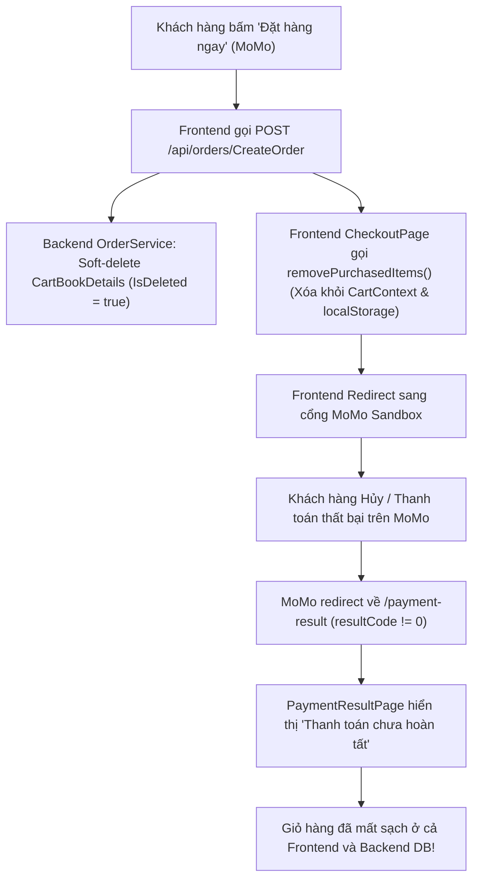
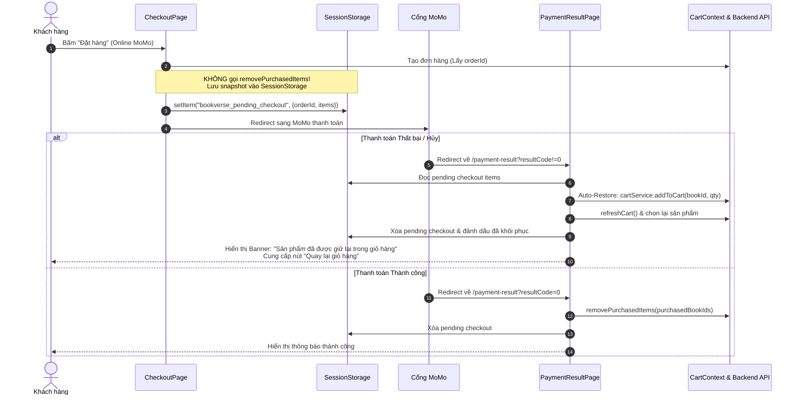

# Kế hoạch Khắc phục Lỗi Business Rule: Giỏ Hàng Bị Mất Khi Thanh Toán Online Thất Bại

## 1. Bối cảnh & Phân tích Nguyên nhân Gốc rễ (Root Cause Analysis)

### Vấn đề hiện tại
Khi khách hàng chọn phương thức thanh toán Online (MoMo Sandbox / VNPay) và tiến hành đặt hàng:
- Dù thanh toán không thành công (người dùng bấm hủy giao dịch trên MoMo, số dư không đủ, hoặc lỗi mạng), màn hình hệ thống hiển thị thông báo "Thanh toán chưa hoàn tất".
- Tuy nhiên, cuốn sách vừa đặt mua bị biến mất hoàn toàn khỏi giỏ hàng (`Cart`). Khách hàng muốn mua lại hoặc chọn phương thức khác (như COD) phải tự tìm kiếm lại sản phẩm từ đầu.
- Điều này vi phạm nghiêm trọng **Business Rule của sàn Thương mại điện tử**: Giỏ hàng chỉ được phép trừ/xóa khi giao dịch thanh toán đã được xác nhận **THÀNH CÔNG**.

---

### Nguyên nhân gốc rễ



1. **Nguyên nhân 1 (Phía Frontend - `CheckoutPage.tsx`)**:
   - Tại `CheckoutPage.tsx` dòng 172 (`MOMO`) và dòng 202 (`VNPAY`): Khi người dùng bấm đặt hàng, hàm `handleSubmitOrder` đã gọi hàm `removePurchasedItems(purchasedBookIds)` **NGAY TRƯỚC KHI** chuyển hướng (redirect) người dùng sang cổng MoMo:
     ```tsx
     if (momoRes?.isRealGateway && momoRes.payment_url) {
       removePurchasedItems(purchasedBookIds); // <-- GỌI QUÁ SỚM!
       window.location.href = momoRes.payment_url;
       return;
     }
     ```
   - Lệnh này ngay lập tức xóa sản phẩm khỏi `CartContext` và `localStorage` ('bookverse_cart') khi việc thanh toán còn chưa bắt đầu.

2. **Nguyên nhân 2 (Phía Backend - `OrderService.cs`)**:
   - Khi Frontend gọi `POST /api/orders/CreateOrder` để khởi tạo đơn hàng nhằm lấy `orderId` truyền vào cổng MoMo, phương thức `CreateOrderAsync` trong Backend đã chủ động duyệt qua `selectedCartList` và đánh dấu:
     ```csharp
     foreach (var item in selectedCartList) {
         item.IsDeleted = true;
         item.UpdatedAt = DateTimeOffset.UtcNow;
     }
     await _context.SaveChangesAsync();
     ```
   - Backend soft-delete các dòng giỏ hàng ngay khi đơn vừa tạo ở trạng thái `PENDING`. Khi thanh toán thất bại, Backend không tự hồi phục lại các món này. Do đó, khi `GET /api/cart/GetCart` được gọi lại, Backend trả về rỗng.

3. **Nguyên nhân 3 (Phía Frontend - `PaymentResultPage.tsx`)**:
   - Khi MoMo redirect về `/payment-result` với `resultCode != "0"`, trang này chỉ hiển thị trạng thái giao dịch chưa hoàn tất. Nó hoàn toàn thiếu logic khôi phục lại các sản phẩm chưa thanh toán vào giỏ hàng và thiếu nút "Quay lại giỏ hàng" để người dùng tiếp tục thao tác.

---

## 2. Ràng buộc & Quy tắc Bắt buộc (User Rules)

> [!IMPORTANT]
> **Quy tắc tuyệt đối**: Theo [AGENTS.md](file:///Users/nguyenvanminhtam/Frontend/AGENTS.md), **Tuyệt đối KHÔNG tự ý chỉnh sửa bất kỳ file mã nguồn nào trong thư mục `Backend/`**.
> Mọi giải pháp điều phối trạng thái, lưu trữ tạm thời (session storage) và phục hồi giỏ hàng (thông qua API `cartService.addToCart`) phải được thực hiện hoàn toàn ở phía **Frontend (`src/`)**.

---

## 3. Đề xuất Giải pháp (Proposed Solution)

### Chiến lược 2 pha: **Deferred Removal** (Hoãn xóa) & **Auto-Restore** (Tự động khôi phục)



---

## 4. Chi tiết Kế hoạch Thay đổi (Proposed Changes)

### Component: Checkout Flow

#### [MODIFY] [CheckoutPage.tsx](file:///Users/nguyenvanminhtam/Frontend/src/pages/customer/CheckoutPage.tsx)
- **Hoãn xóa giỏ hàng cho Online Gateway**:
  - Loại bỏ lệnh `removePurchasedItems(purchasedBookIds)` ở nhánh `selectedGateway === "MOMO"` (dòng 172) và `selectedGateway === "VNPAY"` (dòng 202).
  - Giữ lại `removePurchasedItems(purchasedBookIds)` duy nhất cho phương thức `COD` (dòng 214).
- **Lưu Snapshot Checkout Session**:
  - Lưu cấu trúc vào `sessionStorage.setItem("bookverse_pending_checkout", JSON.stringify({ orderId, items: checkoutItems, gateway: selectedGateway, timestamp: Date.now() }))` trước khi redirect sang MoMo hoặc mở QR Modal.
- **Xử lý MoMo Modal (In-App QR)**:
  - Nếu người dùng mở QR Modal rồi bấm "Đóng / Chọn phương thức khác" mà chưa hoàn tất:
    - Khôi phục lại các mặt hàng trong Backend DB bằng `cartService.addToCart(item.book.id, item.quantity)`.
    - Gọi `refreshCart()`.
    - Hủy đơn PENDING vừa tạo (thông qua `orderService.cancelOrder(orderId, "Người dùng đổi phương thức thanh toán")`) để tránh đơn rác.

---

### Component: Payment Result & Cart Restoration

#### [MODIFY] [PaymentResultPage.tsx](file:///Users/nguyenvanminhtam/Frontend/src/pages/customer/PaymentResultPage.tsx)
- Thêm prop `onGoToCart: () => void`.
- Thêm logic `useEffect` tự động nhận diện kết quả thanh toán:
  - **Khi `isSuccess === true`**:
    - Gọi `removePurchasedItems(pendingBookIds)`.
    - Xóa `sessionStorage.removeItem("bookverse_pending_checkout")`.
  - **Khi `isSuccess === false`**:
    - Kiểm tra Idempotency qua `sessionStorage.getItem("bookverse_restored_" + orderId)` để tránh cộng dồn lặp lại khi người dùng F5.
    - Lấy danh sách sản phẩm từ `sessionStorage` (fallback: gọi `orderService.getOrderById(orderId)` nếu session bị mất).
    - Duyệt qua từng sản phẩm và gọi `cartService.addToCart(bookId, quantity)` để đưa lại vào Backend database.
    - Gọi `refreshCart()` để cập nhật `CartContext` và badge giỏ hàng trên Header.
    - Đánh dấu đã khôi phục vào `sessionStorage`.
- **Cải tiến UI màn hình khi thanh toán thất bại**:
  - Thêm thẻ thông báo màu hổ phách (Amber alert card): *"Sản phẩm của bạn vẫn được lưu giữ an toàn trong giỏ hàng. Vì giao dịch chưa hoàn tất, toàn bộ sách đã được bảo lưu để bạn có thể tiếp tục mua sắm hoặc thử lại."*
  - Nút hành động chính: **"Quay lại giỏ hàng (Đã giữ sách)"** (màu xanh thương hiệu kèm icon Giỏ hàng).
  - Nút phụ: **"Xem đơn hàng của tôi"** & **"Về trang chủ BookVerse"**.

---

### Component: Router & Navigation

#### [MODIFY] [App.tsx](file:///Users/nguyenvanminhtam/Frontend/src/App.tsx)
- Truyền prop `onGoToCart={() => { window.history.replaceState({}, document.title, "/"); setCustomerPage("cart"); }}` vào `<PaymentResultPage />`.

---

## 5. Kế hoạch Kiểm tra & Xác minh (Verification Plan)

### Kiểm tra tự động
- Chạy `npm run build` để đảm bảo code TypeScript biên dịch 100% không lỗi cú pháp hoặc sai kiểu dữ liệu.

### Kiểm tra luồng thủ công (Manual Verification)
1. **Kiểm tra luồng Thất bại / Hủy thanh toán MoMo**:
   - Thêm 1 cuốn sách vào giỏ hàng (`/cart`).
   - Bấm "Tiến hành đặt hàng" sang `/checkout`.
   - Chọn thanh toán qua MoMo và bấm "Đặt hàng ngay".
   - Khi chuyển hướng sang trang kết quả thanh toán với `resultCode=1006` (Hủy bởi người dùng) hoặc non-zero:
     - Quan sát màn hình: Xuất hiện Banner thông báo "Sản phẩm vẫn được giữ trong giỏ hàng".
     - Kiểm tra biểu tượng giỏ hàng trên Header: Số lượng vẫn hiển thị đúng (không bị về 0).
     - Bấm nút **"Quay lại giỏ hàng"**: Cuốn sách vẫn nằm nguyên vẹn trong giỏ hàng với số lượng chính xác, sẵn sàng để người dùng đặt lại.
2. **Kiểm tra luồng Thành công MoMo**:
   - Thanh toán thành công (`resultCode=0`): Giỏ hàng được trừ đi đúng các cuốn sách đã mua.
3. **Kiểm tra luồng COD**:
   - Thanh toán COD: Giỏ hàng được trừ đi ngay lập tức và chuyển sang màn hình thành công.
