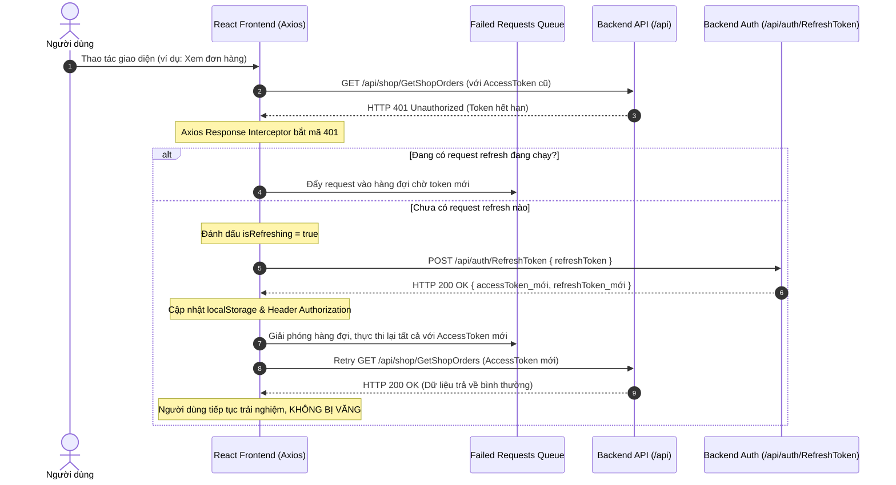

# Kế Hoạch Triển Khai Toàn Diện Cơ Chế Refresh Token (Silent Token Rotation & Axios Interceptor)

## 1. Kết Luận Kiểm Tra Nghi Vấn: ĐÚNG HAY SAI?

> [!IMPORTANT]
> **KẾT LUẬN: NGHI VẤN CỦA BẠN LÀ 100% CHÍNH XÁC (ĐÚNG).**
> 
> Qua kiểm tra đối soát giữa mã nguồn Backend và Frontend:
> 1. **Backend (.NET 8) ĐÃ CÓ ĐẦY ĐỦ**:
>    - Endpoint: `POST /api/auth/RefreshToken` ([AuthController.cs](file:///Users/nguyenvanminhtam/Frontend/Backend/BookManagement.Api/Controllers/AuthController.cs#L82-L87)).
>    - Nhận: `{ "refreshToken": "string" }` ([AuthRequest.cs](file:///Users/nguyenvanminhtam/Frontend/Backend/BookManagement.Service/Auth/AuthRequest.cs#L25-L28)).
>    - Cơ chế: **Token Rotation** bảo mật cao ([UserSessionService.cs](file:///Users/nguyenvanminhtam/Frontend/Backend/BookManagement.Service/Auth/UserSessionService.cs#L191-L215)) — hủy session cũ, cấp `AccessToken` mới cùng `RefreshToken` mới.
>    - Khi đăng nhập (`/auth/login`, `/auth/GoogleLogin`), Backend đều trả về cả `accessToken` lẫn `refreshToken`.
> 
> 2. **Frontend (React + Vite) CHƯA HỀ GỌI**:
>    - Trong [authService.ts](file:///Users/nguyenvanminhtam/Frontend/src/services/authService.ts#L69-L85): Khi login thành công, Frontend chỉ lưu `accessToken` vào `localStorage`, **bỏ quên hoàn toàn `refreshToken`**.
>    - Trong [storage.ts](file:///Users/nguyenvanminhtam/Frontend/src/utils/storage.ts#L2): Có khai báo key `bookverse_refresh_token` nhưng **không hề có hàm `getStoredRefreshToken()` hay `setStoredRefreshToken()`**.
>    - Trong [api.ts](file:///Users/nguyenvanminhtam/Frontend/src/services/api.ts#L65-L70): Khi gặp lỗi `HTTP 401 Unauthorized`, interceptor chỉ ghi log cảnh báo và xóa token (`removeStoredToken()`), khiến người dùng bị **văng phiên đăng nhập đột ngột** dù `RefreshToken` vẫn còn hiệu lực.

---

## 2. Giải Pháp Khắc Phục Toàn Diện

Chúng ta sẽ triển khai mô hình **Silent Token Refresh (Làm mới token ngầm tự động)** với 4 trụ cột:



---

## 3. User Review Required

> [!IMPORTANT]
> - **Chống Race Condition (Xung đột đồng thời)**: Khi người dùng mở trang có 5-10 API gọi cùng lúc (như trang Dashboard vừa load thông tin shop, vừa load đơn hàng, vừa load sản phẩm) và AccessToken vừa hết hạn, tất cả 5-10 request đều nhận 401. Cơ chế `failedQueue` đảm bảo chỉ duy nhất **1 request RefreshToken** được gửi lên Backend, tránh việc gửi 10 request refresh gây lỗi Token Rotation do token đã bị revoke ở lần đầu.
> - **Xử lý khi RefreshToken thực sự hết hạn / bị thu hồi**: Nếu RefreshToken cũng không hợp lệ (Backend trả về 401/400), hệ thống sẽ dọn sạch storage và phát sự kiện `auth:session-expired` để `AuthContext` cập nhật state đăng xuất một cách nhẹ nhàng.

---

## 4. Proposed Changes

### Tầng Lưu Trữ & Tiện Ích (Storage)

#### [MODIFY] [storage.ts](file:///Users/nguyenvanminhtam/Frontend/src/utils/storage.ts)
- Bổ sung `getStoredRefreshToken(): string | null`
- Bổ sung `setStoredRefreshToken(token: string): void`
- Đảm bảo `removeStoredToken()` xóa sạch cả `TOKEN_KEY`, `REFRESH_TOKEN_KEY`, và `USER_KEY`.

---

### Tầng Dịch Vụ Xác Thực (Auth Service)

#### [MODIFY] [authService.ts](file:///Users/nguyenvanminhtam/Frontend/src/services/authService.ts)
- Thêm hàm `refreshToken(): Promise<string>`:
  - Lấy `refreshToken` từ storage.
  - Gửi request `POST /auth/RefreshToken` với body `{ refreshToken }`.
  - Nhận về `data: { accessToken, refreshToken, user }`.
  - Lưu cả `accessToken` mới và `refreshToken` mới (Token Rotation).
  - Trả về `accessToken` mới.
- Cập nhật hàm `login()`: Lưu `setStoredRefreshToken(tokenResponse.refreshToken)` khi đăng nhập thành công.
- Cập nhật hàm `loginWithGoogle()`: Lưu `setStoredRefreshToken(tokenResponse.refreshToken)`.
- Cập nhật hàm `register()`: Lưu `setStoredRefreshToken(tokenResponse.refreshToken)`.
- Cập nhật hàm `logout()`: Tự động lấy `refreshToken` từ storage gửi lên `POST /user/Logout` để Backend vô hiệu hóa phiên trong database.

---

### Tầng Cấu Hình Mạng & Interceptor (API Client)

#### [MODIFY] [api.ts](file:///Users/nguyenvanminhtam/Frontend/src/services/api.ts)
- Xây dựng cơ chế **Queueing Interceptor** xử lý mã HTTP 401:
  - Biến trạng thái: `let isRefreshing = false;`
  - Hàng đợi chờ retry: `let failedQueue: Array<{ resolve: (token: string) => void; reject: (error: any) => void }> = [];`
  - Hàm `processQueue(error: any, token: string | null = null)`: Xử lý giải phóng hàng đợi.
  - Khi gặp lỗi 401:
    - Bỏ qua nếu request đến `/auth/login`, `/auth/register`, `/auth/RefreshToken` (tránh lặp vô tận).
    - Đánh dấu `originalRequest._retry = true`.
    - Nếu đang refresh: Đẩy request vào `failedQueue`.
    - Nếu chưa refresh: Gọi `authService.refreshToken()`, sau đó retry lại request gốc và tất cả các request trong hàng đợi với token mới.
    - Nếu refresh thất bại: Xóa storage, reject hàng đợi và phát event đăng xuất.

---

### Tầng Trạng Thái Người Dùng (Auth Context)

#### [MODIFY] [AuthContext.tsx](file:///Users/nguyenvanminhtam/Frontend/src/contexts/AuthContext.tsx)
- Lắng nghe event `auth:session-expired` từ `api.ts`:
  - Tự động set `user = null`, `token = null`, `role = "customer"`.
- Cập nhật hàm `logout`: Truyền `getStoredRefreshToken()` lên `authService.logout()`.

---

## 5. Verification Plan

### Automated Tests
- Kiểm tra build sản phẩm:
  ```bash
  npm run build
  ```
- Kiểm tra cú pháp & linting:
  ```bash
  npm run lint
  ```

### Manual Verification
1. **Kiểm tra lưu trữ Token khi đăng nhập**:
   - Đăng nhập tài khoản bất kỳ (Customer hoặc Shop).
   - Mở DevTools $\rightarrow$ Application $\rightarrow$ Local Storage.
   - Kiểm tra xem cả 2 key `bookverse_auth_token` VÀ `bookverse_refresh_token` đều có giá trị hợp lệ.
2. **Kiểm tra Silent Refresh khi AccessToken hết hạn**:
   - Mở DevTools $\rightarrow$ Application $\rightarrow$ Sửa giá trị của `bookverse_auth_token` thành một chuỗi sai/hết hạn (ví dụ `invalid_expired_token_123`).
   - Giữ nguyên `bookverse_refresh_token`.
   - Bấm vào một tab hoặc thực hiện 1 request (ví dụ: F5 hoặc chuyển tab Đơn hàng / Kho sách).
   - Quan sát Network tab:
     - Request ban đầu trả về **401 Unauthorized**.
     - Ngay sau đó xuất hiện request **`POST /api/auth/RefreshToken`** trả về **200 OK**.
     - Request ban đầu được tự động thực hiện lại và trả về **200 OK**, dữ liệu hiển thị bình thường, người dùng **không bị văng ra màn hình đăng nhập**.
     - Cả 2 key trong Local Storage đều được cập nhật giá trị mới.
