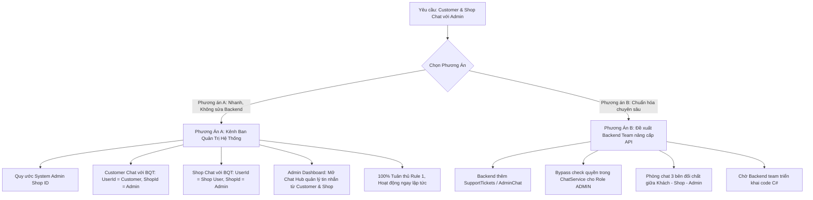

# Kế Hoạch Đánh Giá & Triển Khai Tính Năng: Customer và Shop Chat Với Admin (Xử Lý Tố Cáo, Tranh Chấp & Nghiệp Vụ)

Tài liệu này đánh giá toàn diện hiện trạng Backend (.NET 8), đối chiếu khả năng đáp ứng yêu cầu nghiệp vụ và lập kế hoạch thực thi chi tiết cho Frontend (kèm tài liệu đề xuất Backend nếu cần mở rộng).

---

## 1. Kết Quả Kiểm Tra Chi Tiết Backend: Backend Đã Hỗ Trợ Chưa?

> [!IMPORTANT]
> ### KẾT LUẬN: BACKEND HIỆN TẠI **CHƯA HỖ TRỢ ĐẦY ĐỦ / NGUYÊN BẢN (NATIVE)** CHO VIỆC ADMIN CHAT VỚI CUSTOMER VÀ SHOP
> 
> Backend hiện tại chỉ được thiết kế theo mô hình **Chat 1-1 cố định giữa 1 Khách hàng (`UserId`) và 1 Gian hàng (`ShopId`)**, chưa có kiến trúc phòng chat Ban Quản Trị hay phòng chat 3 bên đối chất.

### Phân tích chi tiết mã nguồn Backend:

| Thành phần Backend | Hiện trạng kỹ thuật | Khả năng đáp ứng Chat Admin |
| :--- | :--- | :--- |
| **Bảng CSDL `Chats` & `Messages`**<br>([Chat.cs](file:///Users/nguyenvanminhtam/Frontend/Backend/BookManagement.Repository/Entities/Chat.cs#L9-L10), [Message.cs](file:///Users/nguyenvanminhtam/Frontend/Backend/BookManagement.Repository/Entities/Message.cs#L8-L12)) | Bảng `Chats` chỉ có 2 trường định danh duy nhất:<br>• `UserId` (Khóa ngoại tới `Users`)<br>• `ShopId` (Khóa ngoại tới `Shops`) | ❌ **Không có** bảng `AdminChats`, `SupportTickets`, `TicketMessages`.<br>❌ Không hỗ trợ phòng chat 3 bên (Khách - Shop - Admin cùng vào trao đổi). |
| **Logic Phân quyền `ChatService.cs`**<br>([ChatService.cs](file:///Users/nguyenvanminhtam/Frontend/Backend/BookManagement.Service/Chat/ChatService.cs#L92-L98)) | Kiểm tra cứng quyền truy cập tin nhắn:<br>```csharp<br>var isCustomer = chat.UserId == requesterId;<br>var isShopOwner = chat.Shop != null && chat.Shop.Id == requesterId;<br>if (!isCustomer && !isShopOwner)<br>    throw new UnauthorizedAccessException("Bạn không có quyền...");<br>``` | ⚠️ **LỖI PHÂN QUYỀN KHI ADMIN THAM GIA**:<br>Dù [ChatController.cs](file:///Users/nguyenvanminhtam/Frontend/Backend/BookManagement.Api/Controllers/ChatController.cs#L50) có khai báo `[Authorize(Roles = "ADMIN,SUPER_ADMIN")]`, nhưng `ChatService` **KHÔNG kiểm tra Role Admin**!<br>Nếu Admin mở một cuộc trò chuyện giữa Khách A và Shop B để kiểm tra tố cáo, Backend lập tức ném lỗi **`401/403 UnauthorizedAccessException`**. |
| **Xử lý Tố cáo / Tranh chấp hiện tại**<br>([AdminController.cs](file:///Users/nguyenvanminhtam/Frontend/Backend/BookManagement.Api/Controllers/AdminController.cs#L72-L97), [FeedbackController.cs](file:///Users/nguyenvanminhtam/Frontend/Backend/BookManagement.Api/Controllers/FeedbackController.cs#L45-L51)) | Các nghiệp vụ tố cáo / tranh chấp hiện tại Backend chỉ làm qua hình thức **phiếu duyệt bất đồng bộ (Form ticket)**:<br>• Khiếu nại hoàn tiền: `ReturnRequests` (`GetDisputes`, `ResolveDispute`).<br>• Báo cáo phản hồi vi phạm: `ReportResponse`, `ModerateShopResponse`. | ❌ **Không có liên kết Chat**: Không có trường `ChatId` liên kết vào `ReturnRequest` hay `FeedbackReport` để 2 bên vào chat live với Admin. |
| **SignalR Realtime Hub**<br>([ChatHub.cs](file:///Users/nguyenvanminhtam/Frontend/Backend/BookManagement.Api/Hubs/ChatHub.cs#L44-L52)) | Quản lý group kết nối theo user và shop:<br>• `user_{userId}`<br>• `shop_{shopId}` | ⚠️ **Chưa có group `admin`**: Khi có khiếu nại mới, SignalR không phát thông báo tới tất cả các Admin đang trực tổng đài. |

---

## 2. Điểm Sáng Trong Backend & Phương Án Khả Thi

Mặc dù chưa có module Chat Admin riêng biệt, trong [ChatService.cs](file:///Users/nguyenvanminhtam/Frontend/Backend/BookManagement.Service/Chat/ChatService.cs#L172-L192) lại tồn tại một cơ chế đặc biệt:
```csharp
// Tự động kiểm tra và bảo đảm bản ghi Shop tồn tại trong CSDL:
var shopUser = await _db.Users.AsNoTracking().FirstOrDefaultAsync(u => u.Id == targetShopId);
if (shopUser != null)
{
    await _db.Database.ExecuteSqlInterpolatedAsync(
        $"IF NOT EXISTS (SELECT 1 FROM Shops WHERE Id = {targetShopId}) INSERT INTO Shops (Id, ShopName, Condition, Rating, ViolationCount) VALUES ({targetShopId}, {shopName}, 'OPEN', 5, 0);");
}
```

Nhờ cơ chế này, **BẤT KỲ TÀI KHOẢN NÀO TRONG BẢNG `Users` (kể cả tài khoản có vai trò `ADMIN` hoặc `SUPER_ADMIN`) ĐỀU CÓ THỂ HOẠT ĐỘNG NHƯ MỘT "KÊNH TIẾP NHẬN CHAT" MÀ KHÔNG GÂY LỖI DATABASE!**

Vì vậy, dự án có **2 hướng tiếp cận chiến lược**:



---

## 3. Chi Tiết Phương Án A (Khuyên Dùng - Triển Khai Ngay 100% Trên Frontend)

Theo **RULE 1: Tuyệt đối KHÔNG tự ý chỉnh sửa bất kỳ file mã nguồn nào trong thư mục `Backend/`**, Phương án A là phương án tối ưu nhất, có thể đưa vào vận hành ngay lập tức:

### 3.1. Cơ chế hoạt động:
1. **Định danh Kênh CSKH / Ban Quản Trị**:
   - Sử dụng ID của tài khoản Admin hệ thống (đã có trong [seed_data.sql](file:///Users/nguyenvanminhtam/Frontend/Backend/seed_data.sql#L29) hoặc tài khoản Admin quản trị viên: tên hiển thị `"Ban Quản Trị BookVerse"` / `"Hỗ Trợ Khách Hàng & Khiếu Nại"`).
2. **Luồng Khách hàng (Customer) chat với Admin**:
   - Khách bấm `[Liên hệ Ban Quản Trị / Khiếu nại]` tại trang chi tiết đơn hàng ([OrderDetailPage.tsx](file:///Users/nguyenvanminhtam/Frontend/src/pages/customer/OrderDetailPage.tsx#L480)) hoặc nút Trợ giúp trên Header.
   - Frontend kích hoạt khung chat với `shopId = ADMIN_SUPPORT_SHOP_ID`, `shopName = "Ban Quản Trị BookVerse"`.
   - Backend tự động liên kết cuộc trò chuyện giữa `UserId = customer.id` và `ShopId = ADMIN_SUPPORT_SHOP_ID`.
3. **Luồng Chủ Shop (Shop) chat với Admin**:
   - Chủ shop bấm `[Trợ giúp & Báo cáo BQT]` tại [ShopDashboardPage.tsx](file:///Users/nguyenvanminhtam/Frontend/src/pages/shop/ShopDashboardPage.tsx).
   - Vì mỗi Shop đều là một User trong hệ thống (`user.id`), Frontend gửi tin nhắn với `senderId = shop.userId`, `receiverId = ADMIN_SUPPORT_SHOP_ID`.
   - Backend tạo đoạn chat giữa `UserId = shop.userId` và `ShopId = ADMIN_SUPPORT_SHOP_ID`.
4. **Giao diện Admin Dashboard ([AdminDashboardPage.tsx](file:///Users/nguyenvanminhtam/Frontend/src/pages/admin/AdminDashboardPage.tsx))**:
   - Bổ sung Tab **"Hỗ trợ & CSKH BQT"** (hoặc tích hợp ngay trong mục Tranh chấp / Khiếu nại / Danh sách Shop).
   - Admin gọi `chatService.getShopConversations(ADMIN_SUPPORT_SHOP_ID)` để tải danh sách tất cả các luồng chat từ Khách hàng và Shop gửi về cho Ban Quản Trị.
   - Admin trả lời trực tiếp, hệ thống gửi tin nhắn realtime qua SignalR Hub về cho Khách hàng hoặc Shop.

---

## 4. Chi Tiết Phương Án B (Tài Liệu Đề Xuất Cho Backend Team)

Nếu bạn muốn Ban Quản Trị có quyền can thiệp vào cuộc trò chuyện **3 BÊN (Khách - Shop - Admin cùng trong 1 phòng để đối chất)** hoặc tạo Module Ticket chuyên nghiệp, chúng ta sẽ gửi tài liệu đề xuất sau cho đội ngũ Backend:

### Đề xuất kỹ thuật gửi Backend Team:
1. **Sửa logic phân quyền trong `ChatService.cs`**:
   ```csharp
   // File: BookManagement.Service/Chat/ChatService.cs - Hàm GetChatMessagesAsync
   var isCustomer = chat.UserId == requesterId;
   var isShopOwner = chat.Shop != null && chat.Shop.Id == requesterId;
   
   // BỔ SUNG: Cho phép Admin/SuperAdmin truy cập bất kỳ phòng chat nào để kiểm duyệt tố cáo
   var isAdmin = await _db.Users.AnyAsync(u => u.Id == requesterId && (u.Role == UserRole.ADMIN || u.Role == UserRole.SUPER_ADMIN));

   if (!isCustomer && !isShopOwner && !isAdmin)
   {
       throw new UnauthorizedAccessException("Bạn không có quyền truy cập đoạn chat này.");
   }
   ```
2. **Bổ sung quan hệ `ChatId` vào `ReturnRequest` (Khiếu nại hoàn tiền)**:
   - Thêm cột `Guid? DisputeChatId` vào entity `ReturnRequest`.
   - Khi Customer gửi khiếu nại (`EscalateReturnRequest`), tự động tạo phòng chat tranh chấp và cấp quyền cho cả Customer, Shop, và Admin cùng vào gửi bằng chứng.
3. **Bổ sung SignalR Group `admin_channel` trong `ChatHub.cs`**:
   - Cho phép các tài khoản có `Role = ADMIN` tự động đăng ký group `admin_support`.
   - Bổ sung method `SendMessageToAdmin(string content, string? imageUrl, string topic)`.

---

## 5. Kế Hoạch Triển Khai Chi Tiết (Theo Phương Án A)

### Giai đoạn 1: Chuẩn hóa Dịch vụ Chat & Định danh Admin Support Channel
- [ ] Khai báo hằng số hệ thống `ADMIN_SUPPORT_SYSTEM_ID` và helper `isAdminSupportThread` trong [chatService.ts](file:///Users/nguyenvanminhtam/Frontend/src/services/chatService.ts).
- [ ] Bổ sung hàm tiện ích `openAdminSupportChat(context?: { orderId?: string; disputeReason?: string; shopId?: string })` để tự động chèn tin nhắn mào đầu (Ví dụ: *"Kính gửi Ban Quản Trị, tôi cần hỗ trợ xử lý khiếu nại đơn hàng #DH1234..."*).

### Giai đoạn 2: Bổ sung Điểm chạm Giao diện cho Customer & Shop
- [ ] **Customer Order Detail ([OrderDetailPage.tsx](file:///Users/nguyenvanminhtam/Frontend/src/pages/customer/OrderDetailPage.tsx))**:
  - Tại khu vực Tranh chấp / Yêu cầu hoàn trả (`Return / Refund Dispute Section`), bổ sung nút:
    `[⚖️ Chat với Ban Quản Trị về khiếu nại này]`
  - Khi bấm, tự động mở `ChatDrawer` kết nối với Kênh Ban Quản Trị và điền sẵn mã đơn hàng cùng nội dung tranh chấp.
- [ ] **Customer Header / Profile Page ([ProfilePage.tsx](file:///Users/nguyenvanminhtam/Frontend/src/pages/customer/ProfilePage.tsx))**:
  - Thêm mục "Trung tâm Trợ giúp & Khiếu nại BookVerse" mở chat trực tiếp với BQT.
- [ ] **Shop Dashboard ([ShopDashboardPage.tsx](file:///Users/nguyenvanminhtam/Frontend/src/pages/shop/ShopDashboardPage.tsx))**:
  - Tại Header hoặc Tab Chat của Shop, thêm nút:
    `[🛡️ Liên hệ Ban Quản Trị Sàn]` để chủ Shop có thể gửi khiếu nại về chính sách, tiền ký quỹ escrow hoặc giải trình đơn vi phạm.

### Giai đoạn 3: Bổ sung Trung tâm CSKH & Quản trị Chat trên Admin Dashboard
- [ ] **Admin Dashboard ([AdminDashboardPage.tsx](file:///Users/nguyenvanminhtam/Frontend/src/pages/admin/AdminDashboardPage.tsx))**:
  - Bổ sung Tab `"support"` (🎧 CSKH & Trợ giúp) vào thanh điều hướng bên trái của Admin.
  - Tích hợp giao diện Chat Splitter 3 cột chuyên nghiệp:
    - **Cột 1**: Danh sách các cuộc trò chuyện từ Customer & Shop gửi về cho BQT (kèm badge phân loại: `Khách hàng`, `Chủ Shop`, `Khiếu nại đơn hàng`).
    - **Cột 2**: Khung chat trung tâm, gửi/nhận tin nhắn realtime qua WebSocket SignalR.
    - **Cột 3**: Thẻ tóm tắt thông tin đối tượng đang chat (Hồ sơ người dùng, Lịch sử đơn hàng, Trạng thái vi phạm / Tranh chấp).
  - Tại Tab Tranh chấp (`disputes`) và Tab Báo cáo phản hồi (`reported responses`), nút "Chat với Shop / Khách" sẽ chuyển tiếp trực tiếp vào kênh chat hỗ trợ này.

---

## 6. Verification Plan (Kế hoạch Kiểm thử & Nghiệm thu)

### Kiểm thử luồng nghiệp vụ:
1. **Luồng Khách hàng -> Admin**:
   - Đăng nhập tài khoản Customer -> Mở đơn hàng có tranh chấp -> Bấm "Chat với Ban Quản Trị".
   - Gửi tin nhắn và hình ảnh bằng chứng sản phẩm lỗi -> Kiểm tra Network request `/api/chat/SendMessage` trả về HTTP 200 OK.
2. **Luồng Chủ Shop -> Admin**:
   - Đăng nhập tài khoản Shop -> Bấm "Liên hệ Ban Quản Trị Sàn".
   - Gửi tin nhắn giải trình vi phạm hoặc thắc mắc chính sách -> Kiểm tra tin nhắn được ghi nhận.
3. **Luồng Admin tiếp nhận & phản hồi**:
   - Đăng nhập tài khoản Admin (`admin` / `superadmin`) -> Mở Tab "CSKH & Hỗ trợ".
   - Kiểm tra hiển thị đầy đủ danh sách tin nhắn từ Khách hàng và Shop.
   - Admin gửi câu trả lời giải quyết tranh chấp -> Xác nhận tin nhắn hiển thị realtime ở phía Khách / Shop mà không cần tải lại trang.
