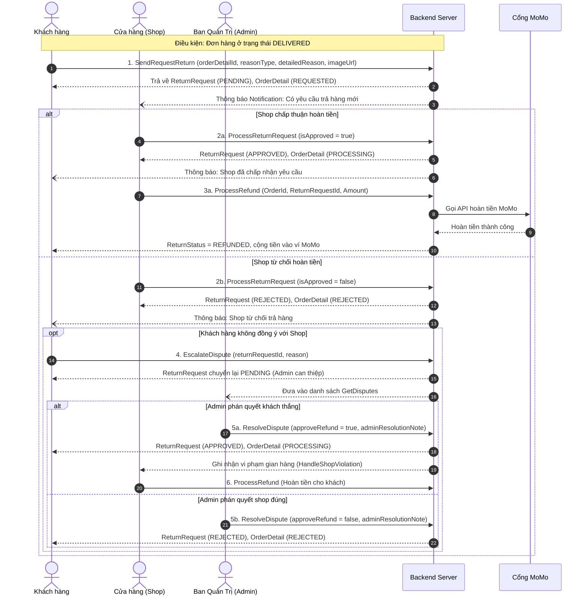

# Kế Hoạch Triển Khai Hoàn Thiện Luồng Trả Hàng & Hoàn Tiền (Return & Refund Flow)

Tài liệu này tổng hợp kết quả phân tích mã nguồn Backend (.NET Core) và Frontend (React/TypeScript), chỉ rõ quy chuẩn dữ liệu của API `ReturnRequest`, đối chiếu thực trạng giao diện hiện tại, làm rõ toàn bộ Business Flow và đề xuất kế hoạch triển khai nâng cấp Frontend đảm bảo hoạt động trơn tru 100% với Backend.

---

## 1. Kiểm tra API `ReturnRequest` (Data Contract)

API khởi tạo yêu cầu hoàn hàng / đổi trả từ phía khách hàng:
- **Endpoint**: `POST /api/orders/SendRequestReturn`
- **Query Parameter bắt buộc**: `orderDetailId={Guid}` (ID của **từng mặt hàng/cuốn sách** trong đơn, KHÔNG PHẢI `orderId` của toàn đơn).
- **Quyền truy cập (Authorization)**: Khách hàng sở hữu đơn (`CUSTOMER`).
- **Điều kiện tiên quyết ở Backend (Pre-conditions)**:
  1. Đơn hàng PHẢI có trạng thái `OrderStatus == DELIVERED` (Đã giao hàng thành công). Nếu đơn đang PENDING, SHIPPING hoặc CANCELLED thì Backend ném ngoại lệ 400.
  2. Mặt hàng đó chưa từng gửi yêu cầu trả hàng trước đó (`orderDetail.ReturnStatus == ReturnStatus.NONE`).
  3. `orderDetail` phải thuộc về tài khoản đang đăng nhập.

### Cấu trúc DTO gửi đi (`CreateReturnRequest`)
```json
{
  "reasonType": "WRONG_ITEM", // Enum: WRONG_ITEM, DAMAGED, DEFECTIVE
  "detailedReason": "Sách bị rách gáy và ướt các trang từ trang 10 đến 30",
  "imageUrl": "https://res.cloudinary.com/.../evidence.jpg",
  "refundAmount": 125000 // decimal: số tiền yêu cầu hoàn (nếu <= 0, Backend tự fallback = unitPrice * quantity)
}
```

### Bảng đối chiếu Data Contract:
| Thuộc tính | Kiểu dữ liệu | Bắt buộc | Mô tả & Ràng buộc Backend |
| :--- | :--- | :--- | :--- |
| `orderDetailId` | `Guid` (Query) | **Có** | ID của mục sách cụ thể (`OrderDetail`) trong đơn. |
| `reasonType` | `Enum (string/int)` | **Có** | Chỉ chấp nhận 3 giá trị: <br>• `WRONG_ITEM` (Giao sai tựa sách)<br>• `DAMAGED` (Bị hư hỏng / rách / móp méo)<br>• `DEFECTIVE` (Lỗi in ấn / thiếu trang) |
| `detailedReason` | `string` | Tùy chọn | Mô tả chi tiết lý do lỗi từ người mua. |
| `imageUrl` | `string` | Tùy chọn | **Link ảnh Cloudinary sau khi upload**. <br>*Lưu ý*: Backend tách riêng API upload (`POST /api/upload/images`) và API tạo yêu cầu (`SendRequestReturn`). Frontend chịu trách nhiệm tải file ảnh từ máy người dùng lên `/api/upload/images`, sau đó lấy URL trả về điền vào trường này. |
| `refundAmount` | `decimal` | Tùy chọn | Số tiền hoàn lại cho cuốn sách đó. |

---

## 2. Đối Chiếu & Đánh Giá Màn Hình Hiện Tại

Qua kiểm tra file [`OrderDetailPage.tsx`](file:///Users/nguyenvanminhtam/Frontend/src/pages/customer/OrderDetailPage.tsx) và hình ảnh người dùng cung cấp:

| Tiêu chí | Backend API Đòi Hỏi | Màn hình hiện tại đã đáp ứng? | Đánh giá & Rủi ro |
| :--- | :--- | :--- | :--- |
| **Phạm vi trả hàng (`orderDetailId`)** | Từng cuốn sách trong đơn | ❌ **Chưa đáp ứng** | Nút bấm hiện tại nằm ở cuối toàn bộ đơn hàng. Trong code `orderService.requestReturn` đang hardcode lấy cuốn đầu tiên `orderDetails[0]`. Nếu đơn mua 3 cuốn khác nhau, khách không thể chọn cuốn nào bị lỗi. |
| **Lý do (`reasonType`)** | Chỉ 3 giá trị: `WRONG_ITEM`, `DAMAGED`, `DEFECTIVE` | ⚠️ **Lỗi sai lệch Enum** | Dropdown hiện tại có: `DAMAGED`, `WRONG_ITEM`, `MISSING_PAGES`, `OTHER`. Nếu khách chọn `MISSING_PAGES` hoặc `OTHER`, Backend `JsonStringEnumConverter` sẽ trả về lỗi **HTTP 400 Bad Request**. |
| **Số tiền hoàn (`refundAmount`)** | Tiền của món hàng lỗi (`UnitPrice * Quantity`) | ⚠️ **Gửi sai số tiền** | Giao diện không hiển thị số tiền hoàn, trong khi code đang truyền cả `totalAmount` của toàn đơn (bao gồm cả phí ship và các cuốn sách khác). |
| **Ảnh bằng chứng (`imageUrl`)** | Upload file ảnh trực tiếp -> URL Cloudinary | ❌ **Trải nghiệm chưa hoàn thiện** | Backend có API `POST /api/upload/images` hỗ trợ upload file trực tiếp lên Cloudinary. Nhưng modal hiện tại chỉ làm sơ sài với 1 ô Textbox bắt người dùng tự dán link URL `https://...`. Người dùng không có sẵn URL web mà chỉ có ảnh chụp trong máy! |
| **Khiếu nại Admin (`EscalateDispute`)** | Khách có quyền khiếu nại lên Admin nếu Shop từ chối | ❌ **Chưa có trên UI** | Khi trạng thái là `REJECTED`, màn hình hiện tại chưa có nút bấm "Khiếu nại lên Ban Quản Trị" để gọi `POST /api/orders/EscalateDispute`. |

---

## 3. Đánh Giá Backend: Đã Cung Cấp Đầy Đủ Tính Năng Chưa?

Backend **ĐÃ CUNG CẤP** đầy đủ các mắt xích logic cốt lõi cho vòng đời đổi trả / khiếu nại, tuy nhiên có một số điểm kỹ thuật cần lưu ý:

### Các tính năng Backend ĐÃ CÓ:
1. **Khách gửi yêu cầu trả hàng**: `POST /api/orders/SendRequestReturn?orderDetailId=...`
2. **Shop duyệt hoặc từ chối yêu cầu**: `POST /api/shop/ProcessReturnRequest?returnRequestId=...`
3. **Khách khiếu nại lên Admin khi Shop từ chối**: `POST /api/orders/EscalateDispute?returnRequestId=...&reason=...`
4. **Admin xem danh sách khiếu nại**: `GET /api/admin/GetDisputes?status=PENDING` và chi tiết `GET /api/admin/GetDisputeDetail`
5. **Admin giải quyết khiếu nại**: `POST /api/admin/ResolveDispute?disputeId=...` (Chấp nhận hoàn tiền hoặc bác bỏ khiếu nại, tự động phạt cảnh cáo Shop nếu Shop sai).
6. **Hoàn tiền điện tử**: `POST /api/payment/ProcessRefund` (Tích hợp API hoàn tiền tự động qua MoMo).
7. **Tải ảnh file bằng chứng**: `POST /api/upload/images` (Đã hỗ trợ upload trực tiếp file multipart lên Cloudinary).
8. **Thông báo Real-time**: Bắn Notification tới chuông thông báo của Buyer và Shop ở mọi lần đổi trạng thái.

### Một số Gaps & Hạn chế ở Backend cần lưu ý:
> [!WARNING]
> 1. **Vận chuyển thu hồi hàng GHN (Return Logistics)**:
>    - Backend **chỉ mới hỗ trợ xin mã vận đơn GHN Sandbox cho CHIỀU GIAO ĐI** (Shop ➡️ Khách qua `POST /api/shipping/CreateGhnOrder`).
>    - **CHƯA CÓ API xin mã vận đơn GHN cho chiều thu hồi/lấy hàng hoàn** (Khách ➡️ Shop): Trong code Backend `ShippingService.cs`, địa chỉ gửi bị cố định là Shop, địa chỉ nhận bị cố định là Khách, và Backend có ràng buộc chặn `Delivery already exists for Order #{order.Id}` (mỗi đơn chỉ cho tạo 1 Delivery chiều đi). Do đó hiện tại chưa thể xin mã vận đơn GHN để shipper đến nhà khách thu hồi hàng.
> 2. **Hoàn tiền COD / VNPay**: API `ProcessRefund` hiện tại chỉ gọi `_momoService.ProcessRefundAsync`. Với các đơn thanh toán COD hoặc VNPay, chưa có API riêng để xác nhận đã chuyển khoản hoàn tiền thủ công hoặc hoàn qua ví nội bộ.
> 3. **Phân quyền `ProcessRefund`**: `PaymentController.ProcessRefund` đang gọi `_shopService.GetShopProfileAsync(userId)`. Do đó API này chỉ Shop mới gọi được; Admin gọi sẽ bị lỗi `Shop not found` vì Admin không có bản ghi trong bảng `Shops`.

---

## 4. Business Flow Toàn Diện (Luồng Nghiệp Vụ Thực Tế)



---

## 5. Kế Hoạch Triển Khai (Frontend Implementation Plan)

### Bước 1: Nâng cấp Modal Yêu Cầu Hoàn Tiền / Đổi Trả (`OrderDetailPage.tsx`)
- [ ] Cho phép khách hàng chọn mặt hàng sách cụ thể trong đơn (`orderDetailId`) hoặc chọn trả hàng ngay tại từng dòng sản phẩm trong đơn hàng.
- [ ] Chuẩn hóa dropdown `ReasonType` khớp 100% với Backend:
  - `WRONG_ITEM`: "Giao sai tựa sách / ấn bản"
  - `DAMAGED`: "Sách bị rách, gãy bìa, ướt hoặc móp méo"
  - `DEFECTIVE`: "Lỗi in ấn, thiếu trang hoặc lỗi kỹ thuật"
- [ ] Hiển thị số tiền hoàn dự kiến tương ứng (`item.unitPrice * item.quantity`).
- [ ] Tích hợp nút upload ảnh (gọi `uploadService.uploadImage`) để khách chọn ảnh chụp trực tiếp từ máy, tự động upload lên Cloudinary và lấy URL gán vào `imageUrl`.

### Bước 2: Bổ sung tính năng Khiếu nại lên Admin (`EscalateDispute`) trên trang chi tiết đơn
- [ ] Khi đơn hàng có mục bị Shop từ chối (`status === "REJECTED"`), hiển thị nút **"Khiếu nại lên Ban Quản Trị"**.
- [ ] Mở modal cho khách nhập lý do khiếu nại đối soát với Shop.
- [ ] Thêm hàm `escalateDispute(returnRequestId, reason)` trong `orderService.ts` gọi `POST /api/orders/EscalateDispute`.

### Bước 3: Sửa lỗi Contract trong các Service hiện tại
- [ ] **Trong [`orderService.ts`](file:///Users/nguyenvanminhtam/Frontend/src/services/orderService.ts)**: Sửa hàm `requestReturn` để nhận `orderDetailId` cụ thể và số tiền hoàn chính xác của item thay vì `totalAmount`.
- [ ] **Trong [`shopService.ts`](file:///Users/nguyenvanminhtam/Frontend/src/services/shopService.ts)**:
  - Sửa hàm `processReturnRequest`: Backend yêu cầu property `isApproved: boolean` (hiện tại frontend đang gửi `isAccepted`, khiến Backend luôn nhận `null` và tự động coi là Từ chối!).
- [ ] **Trong [`adminService.ts`](file:///Users/nguyenvanminhtam/Frontend/src/services/adminService.ts)**:
  - Sửa hàm `handleReturnRequest`: Backend yêu cầu param query `disputeId` (hiện tại frontend gửi `id`) và body `{ approveRefund: boolean, adminResolutionNote: string }` (hiện tại frontend gửi `isAccepted`).
- [ ] **Cập nhật [`src/types/index.ts`](file:///Users/nguyenvanminhtam/Frontend/src/types/index.ts)**: Bổ sung type `ReturnRequestReasonType = "WRONG_ITEM" | "DAMAGED" | "DEFECTIVE"`, bổ sung `orderDetailId` và `returnStatus` chi tiết vào `OrderItem`.

### Bước 4: Tích hợp giao diện Xử lý Đổi trả cho Shop (`ShopDashboardPage.tsx`)
- [ ] Bổ sung tab hoặc bộ lọc "Yêu cầu đổi trả" trong trang quản lý đơn của Shop.
- [ ] Hiển thị chi tiết lý do, ảnh bằng chứng của khách và 2 nút hành động: "Chấp nhận hoàn tiền" / "Từ chối".

---

## 6. Kế Hoạch Kiểm Thử & Xác Minh (Verification Plan)
- **Kiểm thử Modal Khách**:
  1. Thử gửi yêu cầu hoàn tiền với từng loại lý do (`WRONG_ITEM`, `DAMAGED`, `DEFECTIVE`) kèm ảnh chụp tải lên từ máy.
  2. Xác minh API gửi `orderDetailId` chính xác và nhận phản hồi thành công từ Backend (`200 OK`).
- **Kiểm thử Luồng Khiếu nại**:
  1. Đổi trạng thái sang REJECTED và kiểm tra nút "Khiếu nại lên Ban Quản Trị".
  2. Xác minh gọi `EscalateDispute` thành công và đơn hiển thị trong tab Tranh chấp của Admin.
- **Kiểm thử Admin Phán quyết**:
  1. Admin bấm duyệt/bác bỏ khiếu nại, xác minh `ResolveDispute` nhận đúng `disputeId` và `approveRefund`.
