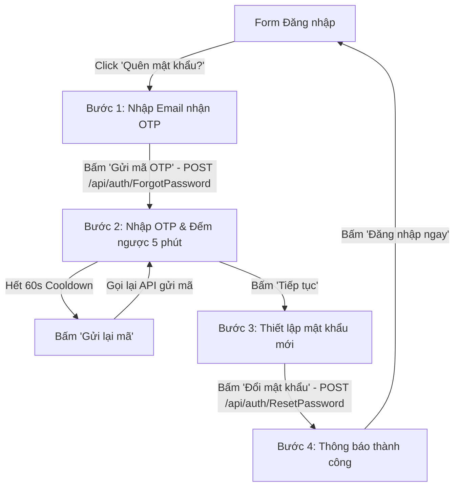

# Kế Hoạch Triển Khai: Giao Diện & Tích Hợp API Quên Mật Khẩu (OTP) & Đặt Lại Mật Khẩu

Kế hoạch này nhằm xây dựng hoàn chỉnh giao diện người dùng (UI/UX) và tích hợp các API xác thực cho tính năng **Quên mật khẩu (Forgot Password)**, **Nhận mã OTP qua Email**, và **Đặt lại mật khẩu mới (Reset Password)** trên Frontend BookVerse.

> [!IMPORTANT]
> **Nguyên tắc bất biến**: Không chỉnh sửa bất kỳ dòng mã nguồn nào trong thư mục `Backend/`. Toàn bộ giao diện và logic sẽ được xây dựng trên Frontend (`src/`) để gọi chính xác tới các API sẵn có của Backend:
> - `POST /api/auth/ForgotPassword` (gửi mã OTP về email)
> - `POST /api/auth/ResetPassword` (xác thực OTP và cập nhật mật khẩu mới)

---

## 1. Đề Xuất Luồng Trải Nghiệm Người Dùng (UX Flow)

---

## 2. Chi Tiết Các File Cần Chỉnh Sửa

### Frontend (`src/`)

#### [MODIFY] [authService.ts](file:///Users/nguyenvanminhtam/Frontend/src/services/authService.ts)
- Cập nhật hàm `forgotPassword(email: string)`:
  - Gọi `POST /api/auth/ForgotPassword` với body `{ email }`.
  - Bắt và bóc tách lỗi từ `error.response.data.message` để hiển thị chính xác thông báo từ Backend.
- Bổ sung hàm `resetPassword(email: string, otpCode: string, newPassword: string)`:
  - Gọi `POST /api/auth/ResetPassword` với body `{ email, otpCode, newPassword }`.
  - Trả về thông báo thành công hoặc ném lỗi có ý nghĩa khi mã OTP sai/hết hạn.

#### [MODIFY] [AuthContext.tsx](file:///Users/nguyenvanminhtam/Frontend/src/contexts/AuthContext.tsx)
- Khai báo thêm trong `AuthContextType`:
  - `forgotPassword: (email: string) => Promise<string>`
  - `resetPassword: (email: string, otpCode: string, newPassword: string) => Promise<string>`
- Cung cấp triển khai tương ứng trong `AuthProvider`.

#### [MODIFY] [AuthModal.tsx](file:///Users/nguyenvanminhtam/Frontend/src/components/auth/AuthModal.tsx)
- Mở rộng State quản lý chế độ hiển thị: `tab` hỗ trợ `"login" | "register" | "forgot"`.
- Bổ sung State riêng cho luồng Forgot Password:
  - `forgotStep: "email" | "otp" | "new_password" | "success"`
  - `forgotEmail: string`
  - `forgotOtp: string`
  - `forgotNewPassword: string`
  - `forgotConfirmPassword: string`
  - `otpCooldown: number` (đếm ngược 60 giây để gửi lại mã)
  - `otpExpiryTimer: number` (đếm ngược 5 phút thời hạn OTP)
- Thêm liên kết *"Quên mật khẩu?"* dưới ô nhập Password của form Đăng nhập.
- Xây dựng 4 giao diện con tinh tế, mượt mà:
  1. **Màn hình Nhập Email**: Có icon Email, validation định dạng email, nút gửi mã với hiệu ứng Loading.
  2. **Màn hình Nhập OTP 6 số**: Ô nhập mã số to rõ, đếm ngược thời gian hiệu lực 5 phút, nút *"Gửi lại mã"* khi hết 60s cooldown.
  3. **Màn hình Nhập Mật khẩu mới**: Ô mật khẩu mới + xác nhận mật khẩu, toggle ẩn/hiện mắt xem, kiểm tra độ khớp và độ dài tối thiểu.
  4. **Màn hình Thành công**: Icon check xanh lá cây, thông báo thành công và nút chuyển nhanh về Đăng nhập.

---

## 3. Kế Hoạch Kiểm Tra & Xác Minh (Verification Plan)

### Kiểm tra tính năng (Manual Verification)
1. **Kiểm tra chuyển đổi màn hình**:
   - Mở modal Đăng nhập -> Bấm *"Quên mật khẩu?"* -> Kiểm tra hiển thị màn hình nhập Email.
   - Bấm *"Quay lại Đăng nhập"* -> Kiểm tra modal quay về form Login bình thường.
2. **Kiểm tra gửi mã OTP**:
   - Nhập email hợp lệ -> Bấm *"Gửi mã OTP"*.
   - Kiểm tra request gửi đi đúng URL `POST /api/auth/ForgotPassword` hoặc `/api/user/ForgotPassword`.
   - Kiểm tra bộ đếm 60s cooldown bắt đầu chạy và nút *"Gửi lại mã"* bị vô hiệu hóa trong 60s.
3. **Kiểm tra xác thực & đặt lại mật khẩu**:
   - Nhập mã OTP và mật khẩu mới -> Bấm *"Xác nhận đổi mật khẩu"*.
   - Kiểm tra request gửi đi đúng URL `POST /api/auth/ResetPassword`.
   - Kiểm tra màn hình thành công hiển thị và có thể đăng nhập lại bằng mật khẩu mới vừa đổi.
4. **Kiểm tra xử lý lỗi**:
   - Nhập OTP sai -> Báo lỗi *"Mã OTP không chính xác hoặc đã hết hạn"*.
   - Mật khẩu xác nhận không khớp -> Báo lỗi *"Mật khẩu xác nhận không trùng khớp"*.
