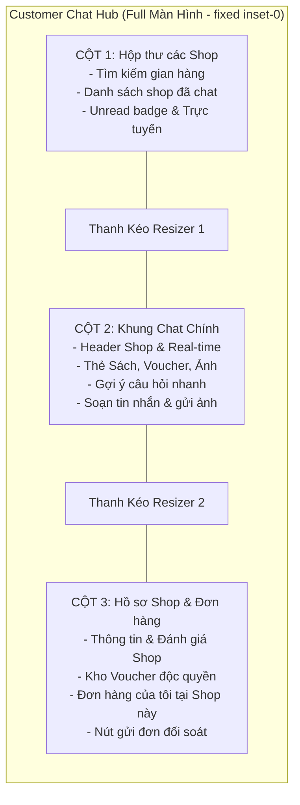

# Kế hoạch Triển khai Giao diện Chat Customer Toàn Màn Hình 3 Cột (Fullscreen 3-Column Chat Hub)

## Phân tích Nhu cầu Người Dùng

Bạn yêu cầu:
> *"Hiện khi ở giao diện customer bấm vào nút bung màn hình ra thì nó vẫn nằm 1 góc bên phải mà không hỗ trợ full màn hình. Bạn hãy dựa trên giao diện chat của shop mà điều chỉnh lại giao diện của chat của customer khi bấm vô cũng sẽ có 3 tab và full màn hình"*

Hiện tại, khi bấm nút phóng to, `ChatDrawer` chỉ mở rộng chiều cao thành thanh bám lề phải (`docked` dạng thanh dọc 420px). Khi khách hàng cần trao đổi chuyên sâu, đối soát đơn hàng, hoặc chat với nhiều shop, giao diện thanh hẹp này chưa tối ưu.

Giải pháp là **nâng cấp nút Bung màn hình (`Maximize2`) thành Chế độ Toàn Màn Hình 3 Cột (Fullscreen 3-Column Chat Hub)**, kế thừa 100% trải nghiệm chuyên nghiệp và tiện nghi từ giao diện Shop!

---

## Kiến trúc Giao diện 3 Cột của Customer (Toàn Màn Hình)



---

## 3 Chế Độ Hiển Thị Linh Hoạt

1. **Chế độ Cửa sổ Nổi góc phải (Floating Window - Nhỏ gọn)**:
   - Kích thước `430px × 620px` tại góc dưới phải màn hình, không che khuất trang web. Dành cho việc hỏi nhanh 1-2 câu khi đang lướt xem sách.
2. **Chế độ Toàn Màn Hình 3 Cột (Fullscreen 3-Column Chat Hub - Khi bấm nút Bung màn hình `Maximize2`)**:
   - Mở rộng toàn bộ màn hình (`fixed inset-0 z-50 bg-slate-100 flex flex-col`).
   - **Thanh Header Toàn Cục**:
     - Logo BookVerse & Tiêu đề *"Hộp thư tư vấn & Mua sắm sách"*.
     - Nút **Thu nhỏ về cửa sổ nổi (`Minimize2`)**.
     - Nút **Đóng (`X`)**.
   - **3 Cột song song có thanh kéo chuột Resizers**:
     - **Cột 1 (Bên trái - Resizable [240px - 450px])**: Danh sách tất cả các Shop đã nhắn tin (Nhà Nam, Phương Nam, Fahasa, Tiki...). Chuyển đổi shop một chạm.
     - **Cột 2 (Ở giữa - Tự co giãn `flex-1`)**: Toàn bộ luồng chat với Shop đang chọn: Bong bóng tin nhắn, Thẻ sản phẩm chuẩn, Voucher, gửi ảnh, gợi ý nhanh.
     - **Cột 3 (Bên phải - Resizable [280px - 500px])**: 
       - **Hồ sơ Shop**: Tên, sao đánh giá, địa chỉ, hotline, link đến gian hàng.
       - **Kho Voucher của Shop**: Danh sách mã giảm giá độc quyền kèm nút "Sao chép mã" / "Lưu mã".
       - **Đơn hàng của tôi tại Shop này**: Danh sách các đơn hàng khách đã mua từ Shop này (mã đơn, ngày đặt, trạng thái, tổng tiền) kèm nút "Gửi vào chat" để hỏi shop tiến độ giao hàng.
3. **Chế độ Thu nhỏ thành Bong bóng (Minimize to Bubble)**:
   - Nút nổi góc dưới phải màn hình khi khách tạm thời ẩn chat.

---

## Chi tiết Triển khai Kỹ thuật

### 1. Quản lý State & Chế độ Toàn Màn Hình trong [`src/components/chat/ChatDrawer.tsx`](file:///Users/nguyenvanminhtam/Frontend/src/components/chat/ChatDrawer.tsx)
- Cập nhật state chế độ hiển thị:
  ```ts
  const [displayMode, setDisplayMode] = useState<"floating" | "fullscreen">("floating");
  const [isMinimized, setIsMinimized] = useState(false);
  const [showRightSidebar, setShowRightSidebar] = useState(true);
  ```
- Thêm state điều khiển độ rộng kéo thả chuột:
  ```ts
  const [col1Width, setCol1Width] = useState(320);
  const [col3Width, setCol3Width] = useState(340);
  const [isDraggingCol1, setIsDraggingCol1] = useState(false);
  const [isDraggingCol3, setIsDraggingCol3] = useState(false);
  const chatContainerRef = useRef<HTMLDivElement>(null);
  ```

### 2. Xây dựng Cột 3 (Hồ sơ Shop & Đơn hàng của tôi tại Shop)
- Tải thông tin hồ sơ Shop qua `bookService.getShopProfile(currentShopId)`.
- Tải đơn hàng của khách hàng qua `orderService.getOrders(user?.id)`.
- Lọc các đơn hàng thuộc về `currentShopId`:
  - Hiển thị danh sách thẻ đơn hàng gọn gàng: Mã đơn `#DH...`, Ngày mua, Trạng thái (Đang giao, Đã giao, Chờ xác nhận), Tổng tiền.
  - Nút **"Hỏi shop về đơn này"**: Tự động gửi tin nhắn kèm mã đơn vào chat để shop kiểm tra vận đơn ngay lập tức.
- Kho Voucher của Shop:
  - Hiển thị các voucher của shop (`BVBOOK10K`, `BVFREESHIP`, `BVVIPBOOK25`) kèm nút "Sao chép mã".

### 3. Tích hợp Thanh Resizer Kéo Chuột (Draggable Splitters)
- Cho phép người dùng dùng chuột kéo vạch ngăn cách giữa Cột 1 - Cột 2 và Cột 2 - Cột 3 để chỉnh độ rộng màn hình theo ý muốn, y hệt như bên Shop.

---

## Kế hoạch Kiểm thử & Xác minh (Verification Plan)

1. **Kiểm tra khi bấm nút Bung Màn Hình**:
   - Từ cửa sổ nổi nhỏ ở góc phải -> Bấm icon Bung to (`Maximize2`).
   - Màn hình chuyển mượt mà sang **Chế độ Toàn Màn Hình 3 Cột**.
2. **Kiểm tra 3 Cột song song**:
   - Cột 1: Hiển thị danh sách tất cả các Shop đã chat. Bấm chọn shop khác -> Cột 2 và Cột 3 tự động chuyển sang shop đó.
   - Cột 2: Khung chat mượt mà, đầy đủ thẻ sách, voucher, nút gửi tin nhắn.
   - Cột 3: Hiển thị hồ sơ Shop, kho voucher và các đơn hàng khách đã mua tại Shop đó. Bấm "Hỏi shop về đơn này" -> gửi ngay mã đơn vào chat.
3. **Kiểm tra Kéo chuột thay đổi độ rộng**:
   - Rê chuột vào vạch phân cách -> Kéo sang trái/phải để tùy chỉnh độ rộng Cột 1 và Cột 3.
4. **Kiểm tra Thu nhỏ lại**:
   - Bấm nút `Minimize2` trên Header -> Khung chat thu nhỏ lại thành Cửa sổ nổi góc phải hoặc Bong bóng chat.
5. **Kiểm tra Build**:
   - Chạy `npm run build` đảm bảo 100% không có lỗi type/compile.
